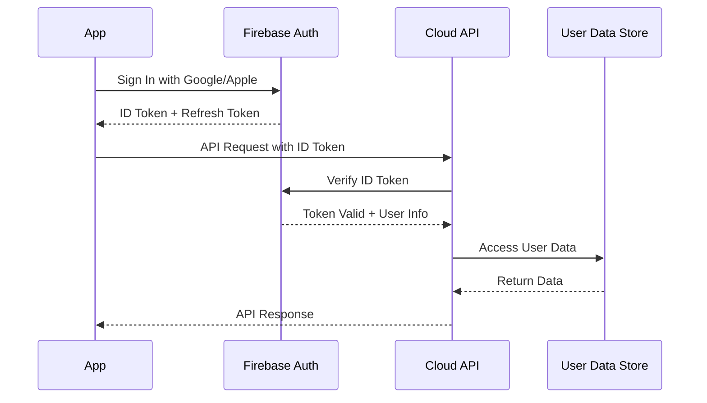

# Backend Architecture

## Service Architecture (Optional Cloud Features)

```
cloud-api/
├── src/
│   ├── routes/
│   │   ├── auth.ts            # Firebase Auth integration
│   │   ├── sync.ts            # Data synchronization
│   │   └── analytics.ts       # Usage analytics (privacy-respecting)
│   ├── services/
│   │   ├── storage.ts         # AWS S3 operations  
│   │   ├── auth.ts            # Token validation
│   │   └── encryption.ts      # End-to-end encryption
│   ├── middleware/
│   │   ├── auth.ts            # Authentication middleware
│   │   ├── rateLimit.ts       # Rate limiting
│   │   └── validation.ts      # Input validation
│   └── server.ts              # Express app setup
```

```typescript
// Serverless function template for cloud features
export const syncUserData = async (req: Request, res: Response) => {
  try {
    const userId = await validateAuthToken(req.headers.authorization);
    const userData = req.body;
    
    // Encrypt user data before storage
    const encryptedData = await encryptUserData(userData);
    
    // Store in S3 with user-specific key
    await s3.putObject({
      Bucket: 'teaflow-user-data',
      Key: `users/${userId}/data.json`,
      Body: encryptedData,
      ServerSideEncryption: 'AES256'
    }).promise();
    
    res.json({ success: true });
  } catch (error) {
    res.status(500).json({ error: error.message });
  }
};
```

## Database Architecture

```sql
-- Cloud database schema (only if user opts into cloud features)
CREATE TABLE users (
    id UUID PRIMARY KEY DEFAULT gen_random_uuid(),
    firebase_uid TEXT UNIQUE NOT NULL,
    created_at TIMESTAMP NOT NULL DEFAULT NOW(),
    last_sync TIMESTAMP,
    data_key TEXT NOT NULL -- For end-to-end encryption
);

CREATE TABLE sync_operations (
    id UUID PRIMARY KEY DEFAULT gen_random_uuid(),
    user_id UUID NOT NULL REFERENCES users(id),
    operation_type TEXT NOT NULL, -- 'upload', 'download'
    status TEXT NOT NULL DEFAULT 'pending',
    created_at TIMESTAMP NOT NULL DEFAULT NOW(),
    completed_at TIMESTAMP
);
```

```typescript
// Data access layer
class UserDataRepository {
  async saveUserData(userId: string, data: EncryptedUserData): Promise<void> {
    const client = await this.getS3Client();
    
    await client.putObject({
      Bucket: process.env.S3_BUCKET,
      Key: `users/${userId}/data.json`,
      Body: JSON.stringify(data),
      ServerSideEncryption: 'AES256',
      Metadata: {
        'encrypted': 'true',
        'version': '1.0'
      }
    }).promise();
  }
  
  async getUserData(userId: string): Promise<EncryptedUserData | null> {
    try {
      const result = await this.getS3Client().getObject({
        Bucket: process.env.S3_BUCKET,
        Key: `users/${userId}/data.json`
      }).promise();
      
      return JSON.parse(result.Body.toString());
    } catch (error) {
      if (error.code === 'NoSuchKey') {
        return null;
      }
      throw error;
    }
  }
}
```

## Authentication and Authorization



```typescript
// Authentication middleware
const authenticateUser = async (req: Request, res: Response, next: NextFunction) => {
  try {
    const authHeader = req.headers.authorization;
    if (!authHeader?.startsWith('Bearer ')) {
      return res.status(401).json({ error: 'No valid token provided' });
    }
    
    const token = authHeader.substring(7);
    const decodedToken = await admin.auth().verifyIdToken(token);
    
    req.user = {
      uid: decodedToken.uid,
      email: decodedToken.email
    };
    
    next();
  } catch (error) {
    res.status(401).json({ error: 'Invalid token' });
  }
};
```
