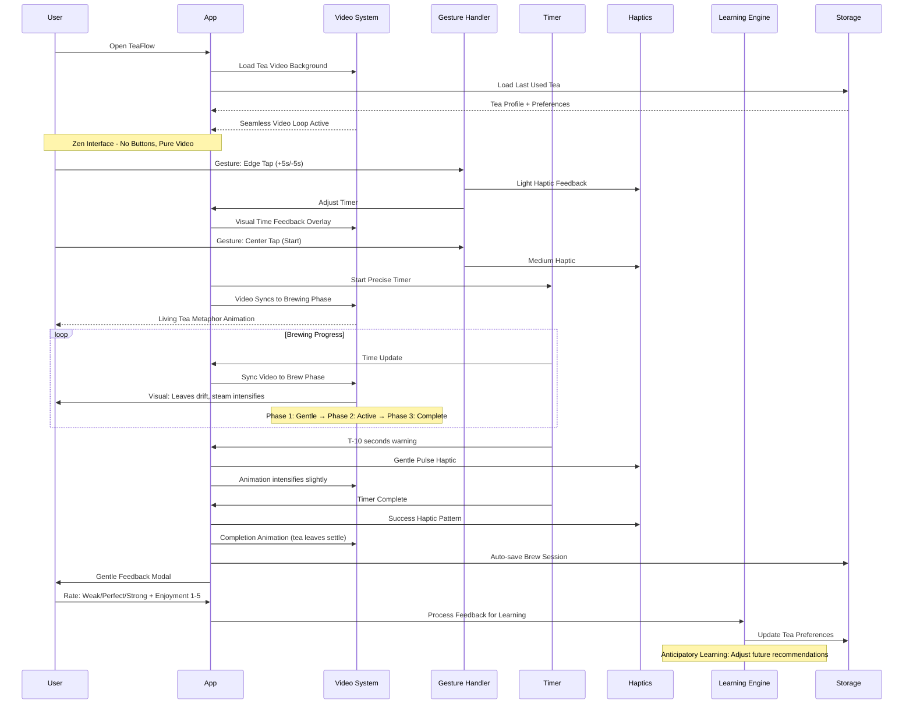
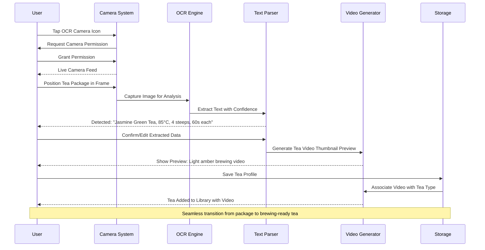
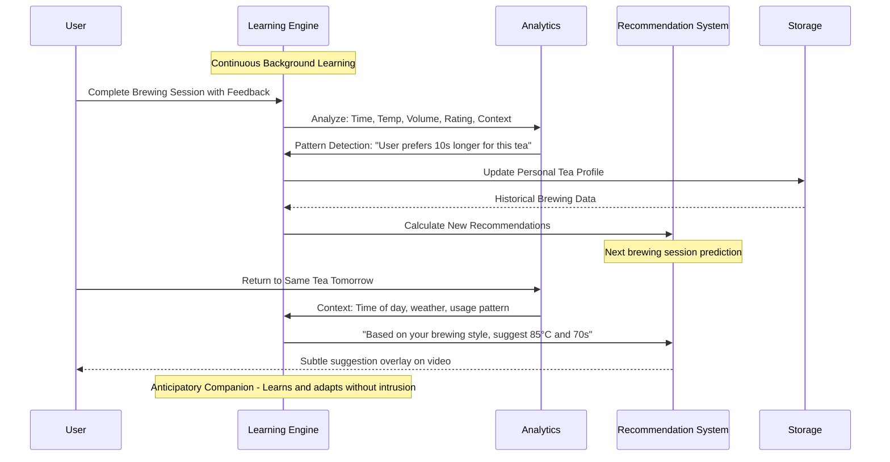

# Core Workflows

## Zen Brewing Session (Gesture-Based)

```mermaid
sequenceDiagram
    participant U as User
    participant A as App
    participant V as Video System
    participant G as Gesture Handler
    participant T as Timer
    participant H as Haptics
    participant L as Learning Engine
    participant S as Storage

    U->>A: Open TeaFlow
    A->>V: Load Tea Video Background
    A->>S: Load Last Used Tea
    S-->>A: Tea Profile + Preferences
    V-->>A: Seamless Video Loop Active
    
    Note over U,A: Zen Interface - No Buttons, Pure Video
    
    U->>G: Gesture: Edge Tap (+5s/-5s)
    G->>H: Light Haptic Feedback
    G->>A: Adjust Timer
    A->>V: Visual Time Feedback Overlay
    
    U->>G: Gesture: Center Tap (Start)
    G->>H: Medium Haptic
    A->>T: Start Precise Timer
    A->>V: Video Syncs to Brewing Phase
    V-->>U: Living Tea Metaphor Animation
    
    loop Brewing Progress
        T->>A: Time Update
        A->>V: Sync Video to Brew Phase
        V->>U: Visual: Leaves drift, steam intensifies
        Note over V: Phase 1: Gentle → Phase 2: Active → Phase 3: Complete
    end
    
    T->>A: T-10 seconds warning
    A->>H: Gentle Pulse Haptic
    A->>V: Animation intensifies slightly
    
    T->>A: Timer Complete
    A->>H: Success Haptic Pattern
    A->>V: Completion Animation (tea leaves settle)
    A->>S: Auto-save Brew Session
    
    A->>U: Gentle Feedback Modal
    U->>A: Rate: Weak/Perfect/Strong + Enjoyment 1-5
    A->>L: Process Feedback for Learning
    L->>S: Update Tea Preferences
    
    Note over L: Anticipatory Learning: Adjust future recommendations
```

## OCR Tea Discovery Workflow

```mermaid
sequenceDiagram
    participant U as User
    participant C as Camera System
    participant O as OCR Engine
    participant P as Text Parser
    participant V as Video Generator
    participant S as Storage

    U->>C: Tap OCR Camera Icon
    C->>U: Request Camera Permission
    U->>C: Grant Permission
    C-->>U: Live Camera Feed
    
    U->>C: Position Tea Package in Frame
    C->>O: Capture Image for Analysis
    O->>P: Extract Text with Confidence
    P-->>U: Detected: "Jasmine Green Tea, 85°C, 4 steeps, 60s each"
    
    U->>P: Confirm/Edit Extracted Data
    P->>V: Generate Tea Video Thumbnail Preview
    V-->>U: Show Preview: Light amber brewing video
    
    U->>S: Save Tea Profile
    S->>V: Associate Video with Tea Type
    V-->>U: Tea Added to Library with Video
    
    Note over U,S: Seamless transition from package to brewing-ready tea
```

## Adaptive Learning Workflow

```mermaid
sequenceDiagram
    participant U as User
    participant L as Learning Engine
    participant A as Analytics
    participant R as Recommendation System
    participant S as Storage

    Note over L: Continuous Background Learning
    
    U->>L: Complete Brewing Session with Feedback
    L->>A: Analyze: Time, Temp, Volume, Rating, Context
    A->>L: Pattern Detection: "User prefers 10s longer for this tea"
    
    L->>S: Update Personal Tea Profile
    S-->>L: Historical Brewing Data
    L->>R: Calculate New Recommendations
    
    Note over R: Next brewing session prediction
    
    U->>A: Return to Same Tea Tomorrow
    A->>L: Context: Time of day, weather, usage pattern
    L->>R: "Based on your brewing style, suggest 85°C and 70s"
    R-->>U: Subtle suggestion overlay on video
    
    Note over L: Anticipatory Companion - Learns and adapts without intrusion
```
