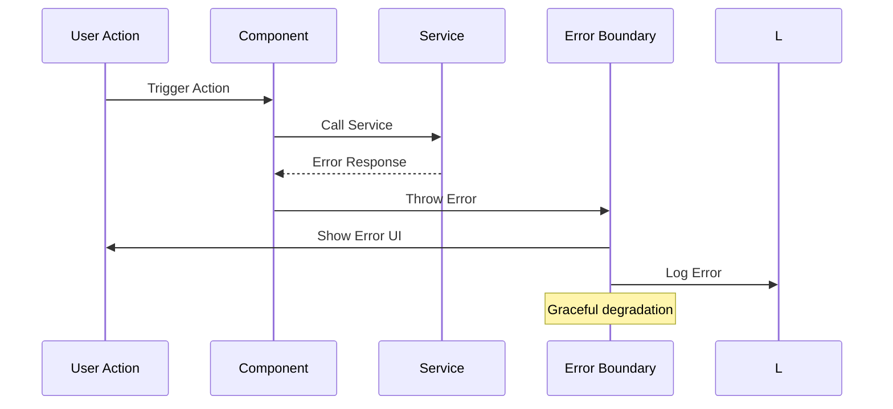

# Error Handling Strategy

## Error Flow



## Error Response Format

```typescript
interface AppError {
  code: string;
  message: string;
  severity: 'low' | 'medium' | 'high';
  recoverable: boolean;
  context?: Record<string, any>;
  timestamp: number;
}
```

## Frontend Error Handling

```typescript
// Global error boundary for React Native
class TeaFlowErrorBoundary extends React.Component {
  componentDidCatch(error: Error, errorInfo: ErrorInfo) {
    // Log error for debugging
    console.error('App Error:', error, errorInfo);
    
    // For non-critical errors, allow graceful degradation  
    if (this.isRecoverableError(error)) {
      this.setState({ hasRecoverableError: true });
      return;
    }
    
    // For critical errors, show fallback UI
    this.setState({ hasCriticalError: true });
  }
  
  private isRecoverableError(error: Error): boolean {
    // Graphics errors are recoverable (fall back to simple UI)
    if (error.message.includes('Skia') || error.message.includes('Graphics')) {
      return true;
    }
    
    // Timer errors are critical
    if (error.message.includes('Timer') || error.message.includes('Countdown')) {
      return false;
    }
    
    return false;
  }
}
```

## Backend Error Handling

```typescript
// Express error handling middleware
const errorHandler = (error: Error, req: Request, res: Response, next: NextFunction) => {
  const appError: AppError = {
    code: error.name || 'UNKNOWN_ERROR',
    message: error.message,
    severity: getSeverity(error),
    recoverable: isRecoverable(error),
    context: {
      path: req.path,
      method: req.method,
      userId: req.user?.uid
    },
    timestamp: Date.now()
  };
  
  // Log based on severity
  if (appError.severity === 'high') {
    console.error('Critical Error:', appError);
  } else {
    console.warn('App Warning:', appError);
  }
  
  res.status(getHttpStatus(appError)).json({ error: appError });
};
```
