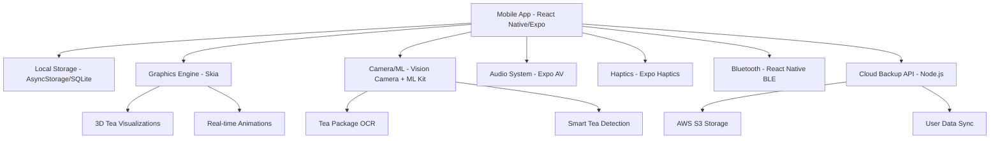

# High Level Architecture

## Technical Summary

TeaFlow employs a React Native + Expo architecture with Skia-powered GPU-accelerated graphics, combining offline-first data storage with optional cloud sync. The frontend leverages React Native Reanimated for gesture-based interactions and React Native Vision Camera with ML Kit for OCR-based tea package scanning. Backend services are implemented as lightweight Node.js APIs for cloud features, while the core application functions entirely offline with AsyncStorage and SQLite persistence.

## Platform and Infrastructure Choice

**Platform:** React Native + Expo (Mobile-first)  
**Key Services:** Expo Application Services, AWS S3 (cloud backup), Firebase (optional analytics)  
**Deployment Host and Regions:** App Store/Google Play Store distribution, global CDN for assets
**Business Model & Cultural Architecture:**
- **Premium Positioning Strategy:** "Moleskine of tea apps" targeting quality users willing to pay for excellence
- **Revenue Targets:** $500K ARR within 18 months through premium app sales + subscription features
- **Free Tier:** Basic timer with 3 tea presets
- **Premium:** $9.99 one-time purchase (unlimited teas, OCR scanning, learning engine, all animations)
- **TeaFlow+ Subscription:** $4.99/month (cloud sync, community wisdom, premium tea guides, exclusive animations)
- **Cultural Authenticity Requirements:** Deep integration with traditional tea ceremony principles, validated by tea community practitioners

**Success KPIs:**
- **DAU/MAU Ratio:** >0.20 (indicating strong habit formation vs occasional use)
- **Session Completion Rate:** >85% (users complete full brewing sessions) 
- **Feature Adoption:** >70% users successfully use gesture controls within first week
- **Revenue per User:** $12+ average (combination of app purchase + optional premium features)
- **Net Promoter Score:** >50 from active users
- **Organic Growth:** >30% of new users from word-of-mouth referrals

**Cultural Validation Framework:**
- **Tea Expert Partnership:** Connect with tea ceremony instructor for authenticity validation
- **Community Feedback Integration:** Tea community practitioner approval required for core features
- **Respectful Innovation Principle:** Technology honors tea traditions while solving modern problems
- **Inclusive Expertise Approach:** Sophisticated capabilities made accessible to all skill levels

## Repository Structure

**Structure:** Monorepo with Expo managed workflow  
**Package Organization:** Feature-based modules with shared utilities, graphics components, and type definitions

## High Level Architecture Diagram

## Architectural Patterns

- **Offline-First Architecture:** Complete functionality without internet connectivity - _Rationale:_ Tea brewing cannot depend on connectivity; core experience must be reliable
- **GPU-Accelerated Graphics:** Skia-based rendering for smooth 60fps animations - _Rationale:_ Creates immersive brewing experience essential for mindfulness and engagement
- **Gesture-Driven Interface:** Touch and swipe controls for timer and settings - _Rationale:_ Hands may be wet/busy during tea brewing; gestures are more practical than buttons
- **ML-Enhanced Input:** OCR for tea package scanning and learning algorithms - _Rationale:_ Reduces friction for adding new teas and personalizes brewing recommendations
- **Haptic Feedback Integration:** Physical feedback for timing and interactions - _Rationale:_ Provides non-visual confirmation essential when not looking at device
- **Performance-Adaptive Rendering:** Graphics complexity scales based on device capabilities - _Rationale:_ Ensures smooth experience across device spectrum while maximizing visual quality
