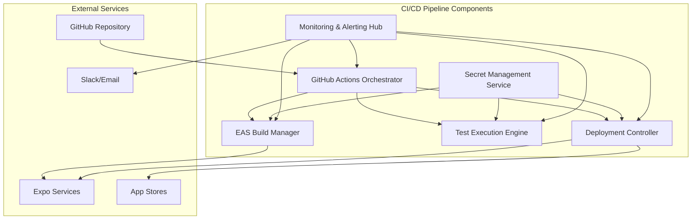

# Components

## CI/CD Pipeline Components

### GitHub Actions Orchestrator

**Responsibility:** Coordinates the entire CI/CD workflow, managing job dependencies, parallelization, and error handling across the pipeline stages.

**Key Interfaces:**
- Webhook receiver for Git events (push, PR, tag)
- EAS Build API client for triggering mobile builds
- Test runner coordinator for Jest and Detox execution
- Notification dispatcher for Slack/email alerts

**Dependencies:** GitHub API, EAS Build service, test frameworks, artifact storage

**Technology Stack:** GitHub Actions YAML workflows, Node.js runtime, GitHub CLI for advanced operations

### EAS Build Manager

**Responsibility:** Manages native iOS and Android build processes, including dependency resolution, code signing, and artifact generation using Expo's cloud infrastructure.

**Key Interfaces:**
- Build configuration API (eas.json parsing)
- Credential management system (certificates, provisioning profiles)
- Artifact upload/download endpoints
- Build status webhooks for pipeline integration

**Dependencies:** Expo CLI, Apple Developer Portal API, Google Play Console API, cloud storage

**Technology Stack:** EAS Build service, Expo CLI, native build tools (Xcode, Gradle), credential management

### Test Execution Engine

**Responsibility:** Executes comprehensive test suites including unit tests, integration tests, and end-to-end mobile testing with gesture simulation and timer validation.

**Key Interfaces:**
- Jest test runner for component and utility testing
- Detox orchestrator for E2E mobile app testing
- Test result aggregation and reporting
- Coverage analysis and threshold enforcement

**Dependencies:** Jest framework, Detox testing library, device simulators, test data fixtures

**Technology Stack:** Jest ^29, Detox ^20, iOS Simulator, Android Emulator, Istanbul coverage

### Deployment Controller

**Responsibility:** Manages automated deployment to app stores and OTA update distribution, with environment-specific configuration and rollback capabilities.

**Key Interfaces:**
- EAS Submit API for app store uploads
- Expo Updates API for OTA publishing
- Environment configuration injection
- Deployment status monitoring and alerting

**Dependencies:** EAS Submit service, Expo Updates, App Store Connect API, Google Play API

**Technology Stack:** EAS Submit, Expo Updates, app store APIs, environment variable management

### Secret Management Service

**Responsibility:** Securely manages and injects environment-specific secrets, API keys, and credentials throughout the pipeline without exposing sensitive data.

**Key Interfaces:**
- GitHub Secrets integration
- EAS Secrets management
- Runtime configuration injection
- Audit logging for secret access

**Dependencies:** GitHub Secrets, EAS Credentials, encryption libraries

**Technology Stack:** GitHub Secrets API, EAS Credentials service, encrypted environment variables

### Monitoring & Alerting Hub

**Responsibility:** Provides comprehensive observability across the CI/CD pipeline, tracking build metrics, deployment success rates, and performance indicators.

**Key Interfaces:**
- Pipeline metrics collection
- Build failure analysis and categorization
- Slack/email notification routing
- Dashboard data aggregation for DevOps visibility

**Dependencies:** GitHub Actions metrics, EAS Build analytics, external monitoring services

**Technology Stack:** GitHub Actions insights, Expo Analytics, Slack webhooks, custom metrics aggregation

## Component Interaction Diagram

