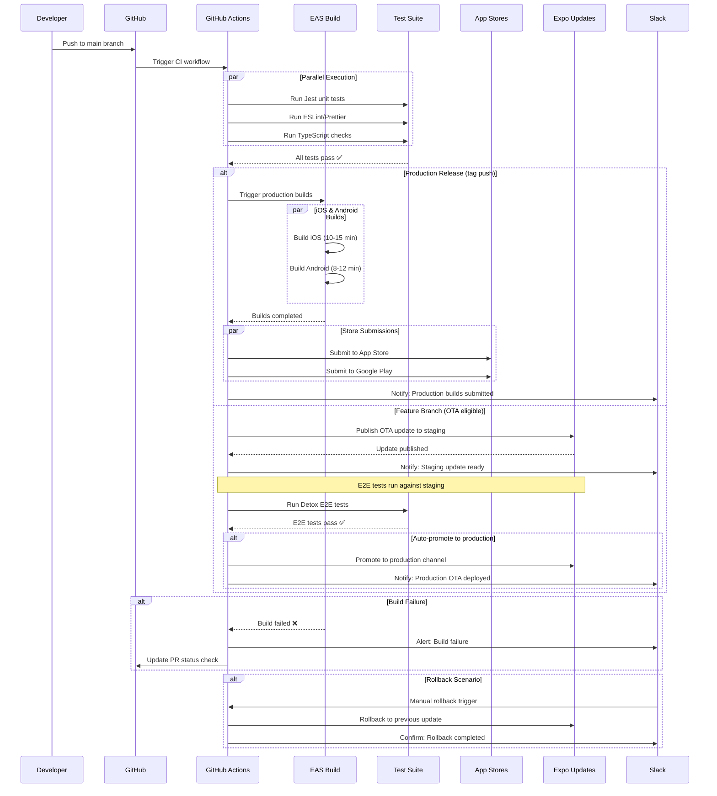

# Core Workflows

## CI/CD Pipeline Sequence Diagram

```mermaid
sequenceDiagram
    participant Dev as Developer
    participant GH as GitHub
    participant GHA as GitHub Actions
    participant EAS as EAS Build
    participant TEST as Test Suite
    participant STORES as App Stores
    participant EXPO as Expo Updates
    participant SLACK as Slack
    
    Dev->>GH: Push to main branch
    GH->>GHA: Trigger CI workflow
    
    par Parallel Execution
        GHA->>TEST: Run Jest unit tests
        GHA->>TEST: Run ESLint/Prettier
        GHA->>TEST: Run TypeScript checks
    end
    
    TEST-->>GHA: All tests pass ✅
    
    alt Production Release (tag push)
        GHA->>EAS: Trigger production builds
        par iOS & Android Builds
            EAS->>EAS: Build iOS (10-15 min)
            EAS->>EAS: Build Android (8-12 min)
        end
        EAS-->>GHA: Builds completed
        
        par Store Submissions
            GHA->>STORES: Submit to App Store
            GHA->>STORES: Submit to Google Play
        end
        
        GHA->>SLACK: Notify: Production builds submitted
        
    else Feature Branch (OTA eligible)
        GHA->>EXPO: Publish OTA update to staging
        EXPO-->>GHA: Update published
        GHA->>SLACK: Notify: Staging update ready
        
        Note over GHA,EXPO: E2E tests run against staging
        GHA->>TEST: Run Detox E2E tests
        TEST-->>GHA: E2E tests pass ✅
        
        alt Auto-promote to production
            GHA->>EXPO: Promote to production channel
            GHA->>SLACK: Notify: Production OTA deployed
        end
    end
    
    alt Build Failure
        EAS-->>GHA: Build failed ❌
        GHA->>SLACK: Alert: Build failure
        GHA->>GH: Update PR status check
    end
    
    alt Rollback Scenario
        SLACK->>GHA: Manual rollback trigger
        GHA->>EXPO: Rollback to previous update
        GHA->>SLACK: Confirm: Rollback completed
    end
```
