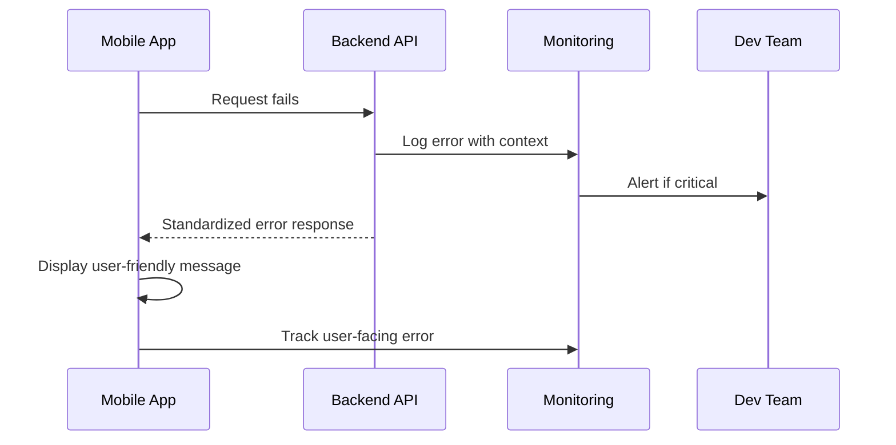

# Error Handling Strategy

## Error Flow



## Error Response Format

```typescript
interface ApiError {
  error: {
    code: string;
    message: string;
    details?: Record<string, any>;
    timestamp: string;
    requestId: string;
  };
}
```

## Frontend Error Handling

```typescript
// Global error boundary for CI/CD pipeline errors
export class CICDErrorBoundary extends React.Component {
  componentDidCatch(error: Error, errorInfo: ErrorInfo) {
    // Log to monitoring service
    Sentry.captureException(error, {
      tags: { 
        component: 'cicd-pipeline',
        environment: process.env.NODE_ENV 
      },
      extra: errorInfo
    });
    
    // Trigger fallback UI
    this.setState({ hasError: true });
  }
}
```

## Backend Error Handling

```typescript
// Standardized CI/CD error handler
export const cicdErrorHandler = (error: Error, req: Request, res: Response) => {
  const errorResponse: ApiError = {
    error: {
      code: error.name || 'PIPELINE_ERROR',
      message: error.message || 'CI/CD pipeline error occurred',
      timestamp: new Date().toISOString(),
      requestId: req.headers['x-request-id'] as string
    }
  };
  
  // Log for monitoring
  logger.error('CI/CD Pipeline Error', {
    error: errorResponse,
    stack: error.stack,
    pipeline: req.headers['x-pipeline-context']
  });
  
  res.status(500).json(errorResponse);
};
```
