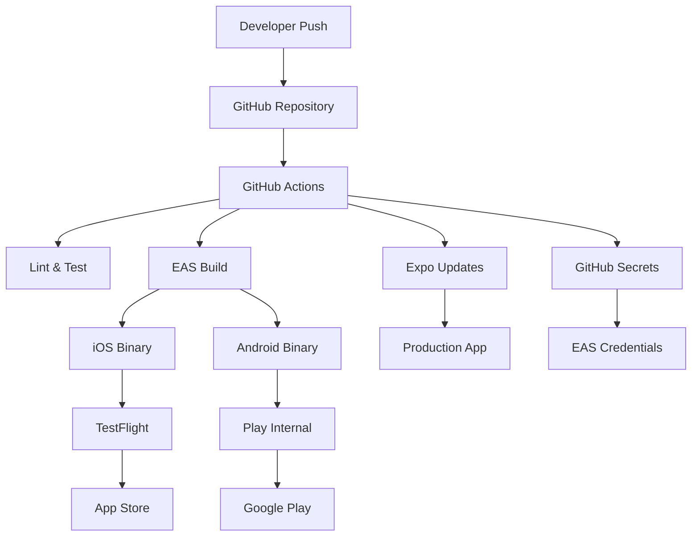

# High Level Architecture

## Technical Summary

TeaFlow's CI/CD architecture leverages **Expo Application Services (EAS)** as the primary build and deployment platform, integrated with **GitHub Actions** for orchestration. The pipeline automatically builds signed iOS and Android binaries, runs comprehensive test suites, and deploys to app stores with OTA update capabilities for rapid iteration. 

Key integration points include EAS Build for native compilation, EAS Submit for automated store deployment, and Expo Updates for seamless over-the-air patches. The infrastructure supports multi-environment promotion (development → staging → production) with automated quality gates and rollback mechanisms.

This architecture achieves TeaFlow's goals of rapid feature deployment, reliable mobile app distribution, and maintainable development workflows while supporting the product roadmap's advanced features like OCR integration and expanded Tea Library functionality.

## Platform and Infrastructure Choice

**Platform:** EAS (Expo Application Services) + GitHub Actions
**Key Services:** EAS Build, EAS Submit, Expo Updates, GitHub Actions, Apple App Store Connect API, Google Play Console API
**Deployment Host and Regions:** Global CDN via Expo's infrastructure (US, EU, APAC regions)

## Repository Structure

**Structure:** Monorepo with Expo managed workflow
**Monorepo Tool:** Native Expo workspace (no additional tooling needed)
**Package Organization:** Single app structure with organized feature modules

## High Level Architecture Diagram

## Architectural Patterns

- **Pipeline as Code:** GitHub Actions YAML workflows version-controlled with source code - _Rationale:_ Ensures CI/CD changes are reviewed and tracked alongside application changes
- **Multi-Stage Deployment:** Development → Staging → Production with automated promotion gates - _Rationale:_ Reduces production deployment risk through progressive validation
- **OTA-First Strategy:** Minor updates via Expo Updates, major releases via app stores - _Rationale:_ Enables rapid bug fixes without 1-7 day app store review delays
- **Artifact Caching:** Aggressive caching of dependencies, build outputs, and test results - _Rationale:_ Reduces build times from 15+ minutes to 3-5 minutes for incremental changes
- **Secret Rotation:** Automated credential refresh for signing certificates and API keys - _Rationale:_ Maintains security compliance without manual intervention
- **Rollback Strategy:** Automated rollback triggers on crash rate or performance degradation - _Rationale:_ Minimizes user impact from problematic releases
