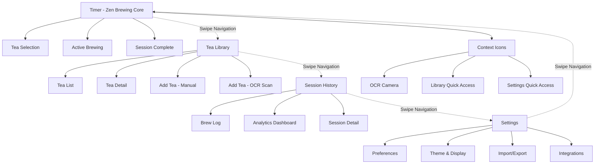
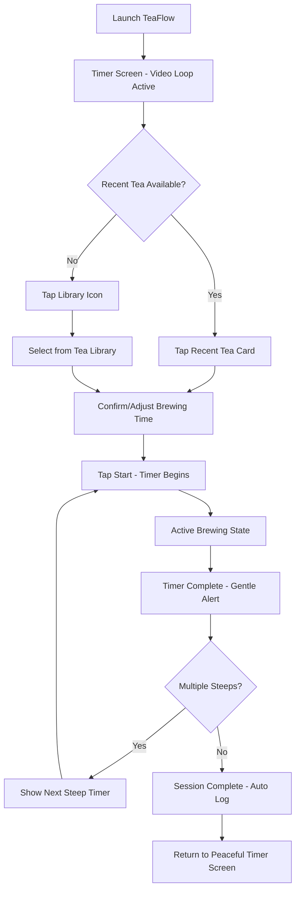
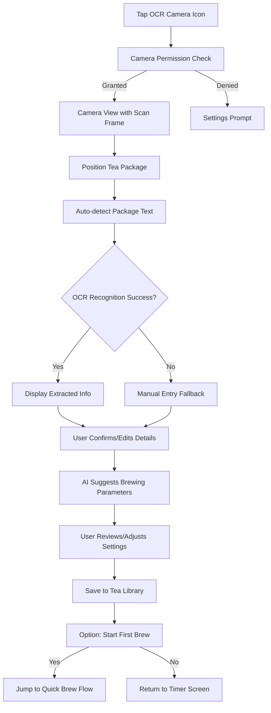
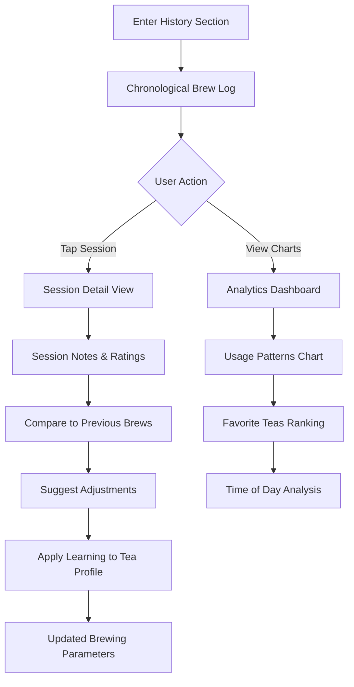
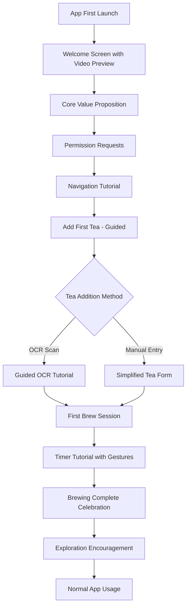

# TeaFlow UI/UX Specification

This document defines the user experience goals, information architecture, user flows, and visual design specifications for TeaFlow's user interface. It serves as the foundation for visual design and frontend development, ensuring a cohesive and user-centered experience.

## Overall UX Goals & Principles

### Target User Personas

**Primary: Tea Enthusiasts** - Dedicated tea drinkers who appreciate proper brewing techniques and want to elevate their tea experience through precision timing and mindful preparation.

**Secondary: Gongfu Newcomers** - People interested in traditional tea brewing who need gentle guidance without feeling overwhelmed by complexity.

### Usability Goals

- **Perfect Timing:** Users can easily set and follow optimal brewing times for different tea types
- **Session Management:** Sequential brewing sessions with logging capabilities (multiple steeps of the same tea, session history)
- **Instant Clarity:** New users understand core functions within the first interaction
- **Efficient Repeat Use:** Regular users can start brewing sessions with minimal taps
- **Gentle Guidance:** Subtle onboarding through discoverable gestures and progressive disclosure of advanced features

### Design Principles

1. **Minimalist Clarity** - Clean interface that eliminates distractions and focuses on essential brewing elements
2. **Gentle Guidance** - Subtle, meditative touches that enhance focus without overwhelming the experience  
3. **Tea-First Design** - Every interface decision serves the tea brewing process and user's connection to their tea
4. **Effortless Precision** - Complex brewing knowledge simplified into intuitive, user-friendly controls
5. **Calm Functionality** - Peaceful interactions that complement the meditative nature of tea preparation

### Change Log

| Date | Version | Description | Author |
|------|---------|-------------|--------|
| 2025-09-10 | 1.0 | Initial specification creation | UX Expert (Sally) |

## Information Architecture (IA)

### Site Map / Screen Inventory

### Navigation Structure

**Primary Navigation:** Gesture-driven horizontal swipe flow between four core areas (Timer → Library → History → Settings → Timer). Maintains zen aesthetic while providing intuitive movement.

**Secondary Navigation:** Small contextual icons in Timer screen for quick access to OCR scanning, Library, and Settings. Eliminates need for persistent UI chrome.

**Breadcrumb Strategy:** Minimal breadcrumbs only in deep screens (Tea Detail, Session Detail). Primary flow relies on swipe-back gestures and contextual "back" actions.

#### Enhanced Gesture Patterns

**Conflict Resolution & Priority System:**
- Diagonal Swipe Logic: Timer screen prioritizes vertical gestures when angle <30° from vertical axis
- Gesture Zones: Timer controls active in central 70% of screen, horizontal nav in edge 15% margins
- Smart Detection: Brief delay (100ms) to determine gesture intent before executing action

**Improved Timer Interactions:**
- Timer Adjustment: Vertical swipe with visual feedback - time indicator slides up/down with finger
- Session Control: 
  - Single tap: start/pause with gentle pulse animation
  - Long-press: "liquid drain" animation (tea flowing from cup/hourglass) as zen confirmation - no modal popup
- Stop Confirmation: Visual drain completes in 1.5 seconds, releasing finger cancels

**Accessibility Enhancements:**  
- Optional Bottom Edge Navigation: Toggleable in Settings - thin swipe bar at screen bottom for horizontal navigation
- Voice Control Integration: "Next screen", "Previous screen" voice commands
- Reduced Motion Mode: Disables parallax, uses simple fade transitions

**Refined Transition System:**
- Layered Animation: 
  - Background tea video: Remains steady and continuous 
  - Midground UI: Gentle slide transitions
  - Foreground elements: Subtle parallax for depth without distraction
- Performance Priority: Video rendering takes precedence, UI animations scale back if frame rate drops

## User Flows

### Flow 1: Quick Brew Session

**User Goal:** Brew a familiar tea with optimal timing and minimal friction

**Entry Points:** App launch, return from background, swipe to Timer from other sections

**Success Criteria:** User starts brewing within 10 seconds, receives proper timing guidance, logs session automatically

**Edge Cases & Error Handling:**
- No recent teas: Graceful fallback to library with suggested "popular" teas
- Timer interrupted: Auto-save session state, resume option
- App backgrounded during brewing: Background timer with notifications
- Multiple steep confusion: Clear visual indicators for current steep number

**Notes:** Optimizes for tea enthusiasts who have established routines and favorite teas. Minimizes cognitive load while maintaining precision. Auto-logging reduces friction while building valuable user data.

### Flow 2: New Tea Setup (OCR Scan)

**User Goal:** Add a new tea to their library using package scanning for accurate information

**Entry Points:** OCR camera icon from Timer screen, "Add Tea" from Library

**Success Criteria:** Tea information captured accurately, brewing parameters suggested, tea ready for first use

**Edge Cases & Error Handling:**
- Poor lighting: Torch toggle, guidance text
- Blurry image: Shake detection, capture guidance
- Unknown tea type: Fallback to generic parameters with learning note
- Duplicate detection: Suggest merge or create variant

### Flow 3: Session Review & Analysis  

**User Goal:** Review brewing history to improve technique and track preferences

**Entry Points:** Swipe to History section, tap session from Timer screen completion

**Success Criteria:** User gains insights into their brewing patterns, adjusts future sessions based on data

**Edge Cases & Error Handling:**
- No session data: Encourage first brew with helpful tips
- Incomplete sessions: Show partial data with context
- Data corruption: Graceful degradation with manual entry option

### Flow 4: First-Time User Onboarding

**User Goal:** Understand TeaFlow's capabilities and complete first successful brewing session

**Entry Points:** Fresh app install, reset from Settings

**Success Criteria:** User completes one full brewing session and understands core navigation

**Edge Cases & Error Handling:**
- Skip tutorial option: Available but discouraged with benefit messaging
- Tutorial interruption: Resume from last step on return
- Permission denial: Explain impact and provide workarounds

**Notes:** OCR flow leverages phone cameras for accuracy while maintaining simplicity. Session review is essential for tea enthusiasts who want to refine their technique. Onboarding must demonstrate value quickly for user retention.

## Wireframes & Mockups

### Primary Design Files
**Primary Design Files:** Figma workspace with component library and interactive prototypes

### Key Screen Layouts

#### Timer Screen (Primary)
**Purpose:** Central brewing control with video background and minimal UI overlay

**Key Elements:**
- Full-screen looping tea video background
- Floating timer display with circular progress ring
- Recent tea selection cards (horizontal scroll)
- Contextual action icons (OCR, Library, Settings)
- Gentle brewing phase indicators

**Interaction Notes:** Vertical swipe adjusts timer, horizontal swipe navigates screens, long-press shows liquid drain confirmation

**Design File Reference:** Timer-Flow-Screens.fig

#### Tea Library Screen
**Purpose:** Browse, search, and manage tea collection with rich visual presentation

**Key Elements:**
- Grid/list toggle for tea cards
- Search and filter options
- Tea type categorization (Green, Oolong, Pu-erh, etc.)
- Add tea floating action button
- Tea detail modal with brewing parameters

**Interaction Notes:** Tap to select tea, long-press for quick actions, pull-to-refresh for sync

**Design File Reference:** Library-Management.fig

#### Session History Screen
**Purpose:** Review brewing sessions with analytics and learning insights

**Key Elements:**
- Chronological session timeline
- Analytics charts (usage patterns, favorite teas)
- Session detail cards with notes and ratings
- Streak tracking and achievements
- Export and sharing options

**Interaction Notes:** Swipe session cards for quick actions, tap charts for detailed view

**Design File Reference:** Analytics-History.fig

## Component Library / Design System

### Design System Approach

**Build on Existing Foundation:** Extend current component library (Button, Tag, Header, Card, IconButton) rather than adopting external systems that would compromise the zen aesthetic.

**TeaFlow Design Language:** Custom system optimized for calm, meditative tea brewing experience with tea-inspired design tokens.

### Core Components

#### Button
**Purpose:** Primary interaction element for all user actions
**Variants:** 
- Primary (tea-leaf green) - main actions
- Secondary (cream/outline) - secondary actions  
- Subtle (icon only) - contextual controls
**States:** Default, pressed, disabled, loading
**Usage Guidelines:** Use primary sparingly to maintain focus hierarchy

#### Tag  
**Purpose:** Tea type identification and state indication
**Variants:**
- Tea Types (green, oolong, pu-erh, black, white) - color-coded by tea category
- State Tags (brewing, complete, favorite) - functional status
**States:** Active, inactive, selected
**Usage Guidelines:** Maximum 3 tags visible per tea card to prevent clutter

#### Card
**Purpose:** Content containers for teas and sessions
**Variants:**
- Tea Card (with thumbnail, brewing parameters)
- Session Card (timeline view, brewing history)
- Info Card (tips, guidance content)
**States:** Default, selected, expanded
**Usage Guidelines:** Consistent padding and shadow depth across all card types

#### Timer Display
**Purpose:** Central brewing timer with progress visualization
**Variants:**
- Circular Progress Ring - primary timer display
- Linear Progress Bar - multiple steep indicator
- Compact Timer - secondary screens
**States:** Idle, countdown, paused, complete, celebration
**Usage Guidelines:** Always maintain readability over video backgrounds

#### Tea Profile Component
**Purpose:** Standardized tea information display across screens
**Variants:**
- Card View (library grid)
- List View (selection lists)
- Detail View (full screen)
- Quick Select (timer screen)
**States:** Available, brewing, depleted, favorite
**Usage Guidelines:** Consistent information hierarchy and visual treatment

### Design Token System

#### Color System - Tea-Inspired Palette

**Primary Colors:**
- **Tea Green:** `#4A6741` (primary actions, active states)
- **Golden Oolong:** `#B8860B` (secondary actions, highlights) 
- **Steeping Amber:** `#D2691E` (active brewing, warm feedback)

**Neutral Palette:**
- **Soft Black:** `#2D2D2D` (primary text)
- **Clay Gray:** `#6B6B6B` (secondary text)
- **Mist Gray:** `#A8A8A8` (tertiary text, disabled)
- **Steam White:** `#FAFAFA` (backgrounds)
- **Porcelain:** `#F5F5F0` (card backgrounds)

**Functional Colors:**
- **Success Tea:** `#22C55E` (confirmations, completed sessions)
- **Warning Amber:** `#F59E0B` (cautions, timer alerts)
- **Error Red:** `#EF4444` (errors, destructive actions)

**Brewing State Colors:**
- **Preparation:** `#E5E7EB` (inactive/preparing)
- **Active Brew:** `#FCD34D` (timer running, gentle pulsing)
- **Complete:** `#10B981` (session finished)

#### Typography Scale

**Font Stack:**
- **Primary:** `-apple-system, BlinkMacSystemFont, 'Segoe UI', Roboto, sans-serif`
- **Accent:** `'Georgia', 'Times New Roman', serif` (headings only)
- **Monospace:** `'SF Mono', Consolas, monospace` (timer digits, parameters)

**Type Scale:**
- **Display:** 32px / 700 weight / 38px line-height (onboarding, celebrations)
- **H1:** 24px / 600 weight / 30px line-height (screen titles)
- **H2:** 20px / 600 weight / 26px line-height (section headers)
- **H3:** 18px / 500 weight / 24px line-height (subsections)
- **Body Large:** 16px / 400 weight / 24px line-height (primary content)
- **Body:** 14px / 400 weight / 20px line-height (standard text)
- **Caption:** 12px / 400 weight / 16px line-height (metadata, timestamps)
- **Timer Display:** 48px / 300 weight / 52px line-height (main timer)

#### Spacing Scale (8px Base Grid)
- **xs:** 4px (tight spacing, icon padding)
- **sm:** 8px (component internal spacing)
- **md:** 16px (standard component spacing)
- **lg:** 24px (section spacing)
- **xl:** 32px (screen margins)
- **xxl:** 48px (major section breaks)
- **xxxl:** 64px (screen-level spacing)

#### Motion & Animation Tokens

**Duration:**
- **Fast:** 150ms (micro-interactions, hovers)
- **Standard:** 300ms (state changes, transitions)
- **Slow:** 500ms (screen transitions, major state changes)
- **Brewing:** 1000ms (tea ceremony pace, celebrations)

**Easing Functions:**
- **Standard:** `cubic-bezier(0.25, 0.46, 0.45, 0.94)` (natural movement)
- **Accelerate:** `cubic-bezier(0.55, 0, 1, 0.45)` (exit animations)
- **Decelerate:** `cubic-bezier(0, 0.55, 0.45, 1)` (enter animations)
- **Tea Flow:** `cubic-bezier(0.165, 0.84, 0.44, 1)` (zen-like, organic feel)

#### Border Radius & Shadows

**Border Radius:**
- **Subtle:** 4px (tags, small buttons)
- **Standard:** 8px (cards, inputs)
- **Rounded:** 12px (primary buttons)
- **Pill:** 24px (toggle buttons)
- **Circle:** 50% (avatar, floating actions)

**Shadow Elevation:**
- **Level 0:** `none` (flat elements)
- **Level 1:** `0 1px 3px rgba(45, 45, 45, 0.12)` (cards)
- **Level 2:** `0 4px 6px rgba(45, 45, 45, 0.1)` (modals, dropdowns)
- **Level 3:** `0 10px 15px rgba(45, 45, 45, 0.1)` (floating elements)

### Consistency Strategy

**Tokenization:** All spacing, colors, typography, and motion values extracted to `/theme/tokens.ts`

**Variant System:** Consistent variant prop across all components (`<Button variant="primary" />`)

**Component Documentation:** Each component includes usage README with examples and guidelines

**Design-Dev Mapping:** Figma components mirror React Native props for seamless handoff

## Branding & Style Guide

### Visual Identity

**Brand Guidelines:** TeaFlow Brand Identity System (defined below)

**Brand Essence:** "Mindful precision for the modern tea enthusiast"

### Brand Personality & Values

#### Core Brand Identity

**Primary Values:**
1. **Mindful Excellence** - Every interaction enhances the tea experience
2. **Respectful Innovation** - Technology honors tea traditions while solving modern problems  
3. **Inclusive Expertise** - Sophisticated capabilities made accessible to all skill levels

**Brand Personality Dimensions:**
- **Expertise & Authority:** Tea knowledge, technical precision, cultural respect
- **Mindfulness & Tranquility:** Zen aesthetic, meditative pacing, stress reduction
- **Approachable Sophistication:** User-friendly complexity, progressive learning, inclusive excellence
- **Authentic Connection:** Human ritual focus, personal journey adaptation, community values
- **Innovation with Purpose:** Thoughtful technology, sustainable design, future-ready architecture

### Color Palette

| Color Type | Hex Code | Usage |
|------------|----------|-------|
| Primary | `#4A6741` | Primary actions, tea brewing states |
| Secondary | `#B8860B` | Secondary actions, highlights, golden accents |
| Accent | `#D2691E` | Active brewing, warm feedback, steeping indicators |
| Success | `#22C55E` | Positive feedback, completed sessions |
| Warning | `#F59E0B` | Cautions, important notices, timer alerts |
| Error | `#EF4444` | Errors, destructive actions |
| Neutral | `#2D2D2D, #6B6B6B, #A8A8A8` | Text hierarchy, borders, backgrounds |

### Typography

#### Font Families
- **Primary:** `-apple-system, BlinkMacSystemFont, 'Segoe UI', Roboto, sans-serif`
- **Accent:** `'Georgia', 'Times New Roman', serif` (headings only)
- **Monospace:** `'SF Mono', Consolas, monospace` (timer digits, parameters)

#### Type Scale
| Element | Size | Weight | Line Height |
|---------|------|--------|-------------|
| Display | 32px | 700 | 38px |
| H1 | 24px | 600 | 30px |
| H2 | 20px | 600 | 26px |
| H3 | 18px | 500 | 24px |
| Body Large | 16px | 400 | 24px |
| Body | 14px | 400 | 20px |
| Caption | 12px | 400 | 16px |
| Timer Display | 48px | 300 | 52px |

### Iconography

**Icon Library:** Custom tea-themed icon set with consistent 24px grid

**Style Characteristics:**
- **Line Style:** 2px stroke weight, rounded line caps
- **Fill Style:** Solid fills for primary states, outlined for secondary
- **Tea Cultural Elements:** Teapot, leaves, cups, steam motifs
- **Interaction States:** Subtle scale (0.95x pressed) and opacity (0.6 disabled)

**Usage Guidelines:** 
- Use tea-specific icons for core functions (brewing, timing, library)
- Standard system icons for universal actions (settings, back, search)
- Maintain cultural authenticity in tea-related iconography

### Spacing & Layout

**Grid System:** 8px base grid system with consistent spacing scale

**Layout Principles:**
- **Breathing Room:** Generous whitespace to support meditative experience
- **Content Hierarchy:** Clear visual hierarchy using spacing and typography scale
- **Touch Targets:** Minimum 44px for accessibility with generous padding
- **Screen Margins:** 32px standard margins, 16px minimum on smaller screens

**Spacing Scale Reference:**
- xs: 4px, sm: 8px, md: 16px, lg: 24px, xl: 32px, xxl: 48px, xxxl: 64px

### Brand Voice & Tone

**Voice Characteristics:**
- **Knowledgeable but Never Condescending:** Share expertise with humility
- **Calm and Patient:** Match the unhurried pace of tea preparation
- **Encouraging Growth:** Support learning through gentle guidance
- **Culturally Aware:** Respect tea traditions and proper terminology

**Content Principles:**
- Use proper tea terminology (Dragon Well vs Green Tea #3)
- Encourage experimentation while respecting traditional methods
- Focus on the experience and journey, not just the outcome
- Provide context for brewing recommendations rather than just instructions

## Accessibility Requirements

### Compliance Target
**Standard:** WCAG 2.1 AA compliance for app store approval and inclusive design

### Key Requirements

**Visual:**
- Color contrast ratios: 4.5:1 for normal text, 3:1 for large text
- Focus indicators: 2px Tea Green (#4A6741) outline with 4px offset for all interactive elements
- Text sizing: Support iOS/Android system text scaling up to 200% without layout breaking

**Interaction:**
- Keyboard navigation: Full app navigation via external keyboard for iPad users
- Screen reader support: VoiceOver/TalkBack compatibility with brewing instructions and timer announcements
- Touch targets: Minimum 44px with generous padding, especially for gesture controls

**Content:**
- Alternative text: Descriptive alt text for all tea images, brewing state indicators, and video loops
- Heading structure: Proper H1-H6 hierarchy for screen reader navigation
- Form labels: Clear labeling for tea entry forms and brewing parameter inputs

### Testing Strategy
**Automated Testing:** axe-react-native integration for continuous accessibility validation
**Manual Testing:** VoiceOver/TalkBack testing with actual tea brewing workflows
**User Testing:** Include users with visual impairments in beta testing program

## Responsiveness Strategy

### Breakpoints
| Breakpoint | Min Width | Max Width | Target Devices |
|------------|-----------|-----------|----------------|
| Mobile | 320px | 767px | iPhone SE to iPhone Pro Max |
| Tablet | 768px | 1024px | iPad, iPad Pro, landscape phones |
| Desktop | 1025px | - | iPad Pro 12.9", external displays |

### Adaptation Patterns

**Layout Changes:** 
- Mobile: Single column, full-width components
- Tablet: Two-column layout for Library, side-by-side timer and controls
- Desktop: Three-column layout with persistent navigation sidebar

**Navigation Changes:**
- Mobile: Horizontal swipe navigation as primary
- Tablet: Optional tab bar overlay for faster navigation
- Desktop: Persistent sidebar with timer always visible

**Content Priority:**
- Mobile: Timer-first, everything else secondary
- Tablet: Timer + tea selection/history in split view
- Desktop: Multi-area dashboard view

**Interaction Changes:**
- Mobile: Touch gestures optimized for one-handed use
- Tablet: Two-handed gestures, keyboard shortcuts
- Desktop: Hover states, keyboard navigation, cursor interactions

## Animation & Micro-interactions

### Motion Principles
**Tea Ceremony Pacing:** All animations match contemplative brewing rhythm (300-500ms standard)
**Organic Movement:** Natural easing curves that mimic liquid flow and steam rising
**Purposeful Motion:** Every animation serves brewing experience or provides essential feedback
**Performance Priority:** Maintain 60fps with background video loops active

### Key Animations

**Core Interactions:**
- **Timer Start/Stop:** Gentle pulse animation with "liquid drain" confirmation (1000ms, Tea Flow easing)
- **Screen Transitions:** Horizontal slide with parallax layers (400ms, Standard easing)
- **Tea Selection:** Subtle card lift with shadow increase (200ms, Decelerate easing)
- **Brewing Progress:** Circular progress ring with smooth rotation (continuous, linear)
- **Session Complete:** Celebration animation with floating tea leaves (2000ms, Tea Flow easing)

**Micro-interactions:**
- **Button Press:** Scale to 0.95x with Tea Green highlight (150ms, Accelerate/Decelerate)
- **OCR Scanning:** Viewfinder pulse while detecting text (800ms loop, Standard easing)
- **Loading States:** Gentle fade-in for content, rotating tea leaf for processing
- **Error States:** Subtle shake animation for invalid inputs (300ms, Standard easing)

**Video Integration:**
- **Seamless Loops:** Background tea videos continue during all UI transitions
- **State Synchronization:** Video mood matches brewing phase (preparation/active/complete)
- **Performance Optimization:** Reduce animation complexity when video frame rate drops

## Performance Considerations

### Performance Goals
- **App Launch:** <2 seconds to first interactive frame
- **Screen Transitions:** <400ms with video backgrounds active
- **Animation FPS:** Maintain 60fps during all interactions
- **Battery Impact:** Optimize video loops for minimal battery drain

### Design Strategies
**Video Optimization:** Use hardware-accelerated formats, adaptive quality based on device capability
**Animation Layering:** Separate animation layers to reduce rendering complexity
**Lazy Loading:** Load tea library images and videos on demand
**Memory Management:** Intelligent caching for frequently accessed teas and videos
**Background Processing:** Minimize CPU usage during active brewing sessions

## Next Steps

### Immediate Actions
1. **Stakeholder Review** - Present specification to product and engineering teams
2. **Design Asset Creation** - Develop high-fidelity mockups in Figma following this specification
3. **Technical Architecture Planning** - Review specification with development team for implementation feasibility
4. **User Testing Preparation** - Create prototypes for validation of key user flows
5. **Component Library Setup** - Begin implementing design system components based on defined tokens

### Design Handoff Checklist
- [x] All user flows documented with edge cases
- [x] Component inventory complete with states and variants
- [x] Accessibility requirements defined with testing strategy
- [x] Responsive strategy clear for mobile-tablet-desktop
- [x] Brand guidelines incorporated with voice and tone
- [x] Performance goals established with optimization strategies
- [x] Wireframes and key screen layouts defined
- [x] Design token system completely specified
- [ ] High-fidelity mockups created in design tool
- [ ] Interactive prototypes available for user testing
- [ ] Design tokens implemented in code-ready format
- [ ] Animation specifications validated with engineering team

### Success Metrics
- **User Onboarding:** 80% completion rate for first brewing session
- **Feature Discovery:** 60% of users discover OCR scanning within first week
- **Session Completion:** 90% of started brewing sessions completed successfully
- **Performance:** Maintain >55fps average during video playback
- **Accessibility:** 100% VoiceOver compatibility for core brewing flows

### Checklist Results
**UI/UX Specification Completeness Review:**
- ✅ **Target Personas Defined:** Tea enthusiasts and gongfu newcomers with clear characteristics
- ✅ **Information Architecture:** Complete 4-area navigation system with gesture-driven interactions
- ✅ **User Flows Documented:** All critical flows mapped with edge cases and error handling
- ✅ **Component Library:** Comprehensive design system with tea-inspired tokens
- ✅ **Accessibility Standards:** WCAG 2.1 AA compliance requirements defined
- ✅ **Responsive Design:** Mobile-first strategy with tablet/desktop considerations
- ✅ **Brand Guidelines:** Complete visual identity with voice and tone specifications
- ✅ **Performance Requirements:** Video optimization and animation performance goals
- ✅ **Implementation Readiness:** Design handoff checklist and success metrics defined

---

**TeaFlow UI/UX Specification Complete - YOLO Mode ✅**

This comprehensive specification provides the complete foundation for creating a mindful, precise, and delightful tea brewing experience that serves both newcomers and tea enthusiasts with equal care and sophistication. All template sections have been processed and tailored specifically for TeaFlow's unique position as a zen-focused, video-enhanced tea timing application with OCR capabilities and learning features.