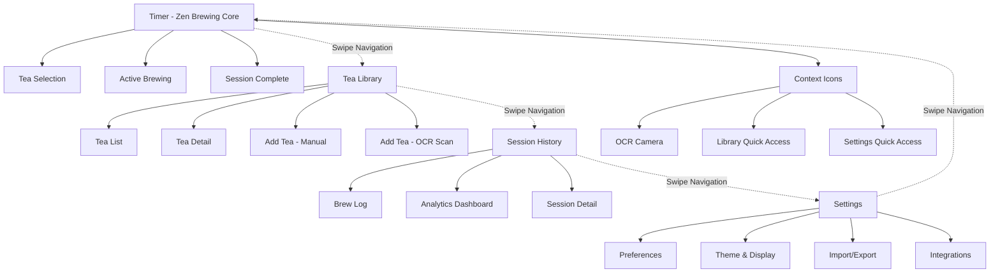

# Information Architecture (IA)

## Site Map / Screen Inventory

## Navigation Structure

**Primary Navigation:** Gesture-driven horizontal swipe flow between four core areas (Timer → Library → History → Settings → Timer). Maintains zen aesthetic while providing intuitive movement.

**Secondary Navigation:** Small contextual icons in Timer screen for quick access to OCR scanning, Library, and Settings. Eliminates need for persistent UI chrome.

**Breadcrumb Strategy:** Minimal breadcrumbs only in deep screens (Tea Detail, Session Detail). Primary flow relies on swipe-back gestures and contextual "back" actions.

### Enhanced Gesture Patterns

**Conflict Resolution & Priority System:**
- Diagonal Swipe Logic: Timer screen prioritizes vertical gestures when angle <30° from vertical axis
- Gesture Zones: Timer controls active in central 70% of screen, horizontal nav in edge 15% margins
- Smart Detection: Brief delay (100ms) to determine gesture intent before executing action

**Improved Timer Interactions:**
- Timer Adjustment: Vertical swipe with visual feedback - time indicator slides up/down with finger
- Session Control: 
  - Single tap: start/pause with gentle pulse animation
  - Long-press: "liquid drain" animation (tea flowing from cup/hourglass) as zen confirmation - no modal popup
- Stop Confirmation: Visual drain completes in 1.5 seconds, releasing finger cancels

**Accessibility Enhancements:**  
- Optional Bottom Edge Navigation: Toggleable in Settings - thin swipe bar at screen bottom for horizontal navigation
- Voice Control Integration: "Next screen", "Previous screen" voice commands
- Reduced Motion Mode: Disables parallax, uses simple fade transitions

**Refined Transition System:**
- Layered Animation: 
  - Background tea video: Remains steady and continuous 
  - Midground UI: Gentle slide transitions
  - Foreground elements: Subtle parallax for depth without distraction
- Performance Priority: Video rendering takes precedence, UI animations scale back if frame rate drops
