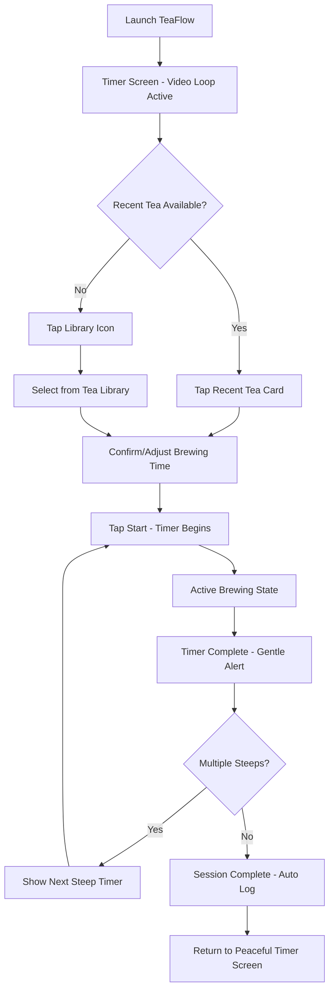
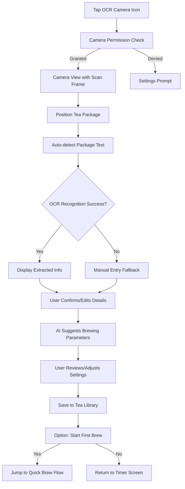
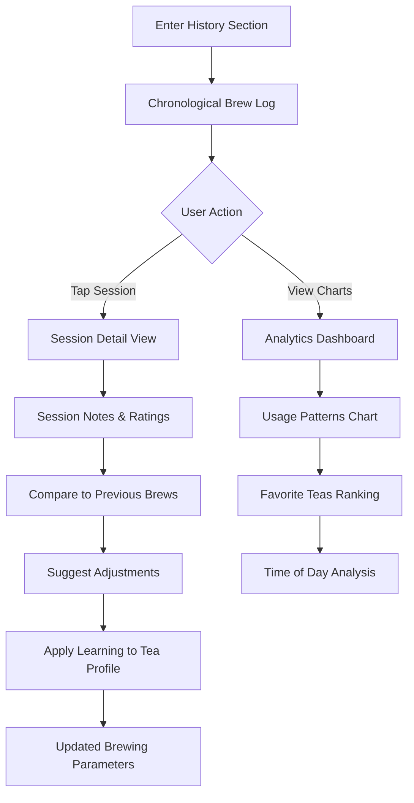
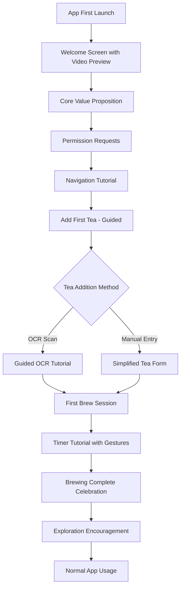

# User Flows

## Flow 1: Quick Brew Session

**User Goal:** Brew a familiar tea with optimal timing and minimal friction

**Entry Points:** App launch, return from background, swipe to Timer from other sections

**Success Criteria:** User starts brewing within 10 seconds, receives proper timing guidance, logs session automatically

**Edge Cases & Error Handling:**
- No recent teas: Graceful fallback to library with suggested "popular" teas
- Timer interrupted: Auto-save session state, resume option
- App backgrounded during brewing: Background timer with notifications
- Multiple steep confusion: Clear visual indicators for current steep number

**Notes:** Optimizes for tea enthusiasts who have established routines and favorite teas. Minimizes cognitive load while maintaining precision. Auto-logging reduces friction while building valuable user data.

## Flow 2: New Tea Setup (OCR Scan)

**User Goal:** Add a new tea to their library using package scanning for accurate information

**Entry Points:** OCR camera icon from Timer screen, "Add Tea" from Library

**Success Criteria:** Tea information captured accurately, brewing parameters suggested, tea ready for first use

**Edge Cases & Error Handling:**
- Poor lighting: Torch toggle, guidance text
- Blurry image: Shake detection, capture guidance
- Unknown tea type: Fallback to generic parameters with learning note
- Duplicate detection: Suggest merge or create variant

## Flow 3: Session Review & Analysis  

**User Goal:** Review brewing history to improve technique and track preferences

**Entry Points:** Swipe to History section, tap session from Timer screen completion

**Success Criteria:** User gains insights into their brewing patterns, adjusts future sessions based on data

**Edge Cases & Error Handling:**
- No session data: Encourage first brew with helpful tips
- Incomplete sessions: Show partial data with context
- Data corruption: Graceful degradation with manual entry option

## Flow 4: First-Time User Onboarding

**User Goal:** Understand TeaFlow's capabilities and complete first successful brewing session

**Entry Points:** Fresh app install, reset from Settings

**Success Criteria:** User completes one full brewing session and understands core navigation

**Edge Cases & Error Handling:**
- Skip tutorial option: Available but discouraged with benefit messaging
- Tutorial interruption: Resume from last step on return
- Permission denial: Explain impact and provide workarounds

**Notes:** OCR flow leverages phone cameras for accuracy while maintaining simplicity. Session review is essential for tea enthusiasts who want to refine their technique. Onboarding must demonstrate value quickly for user retention.
