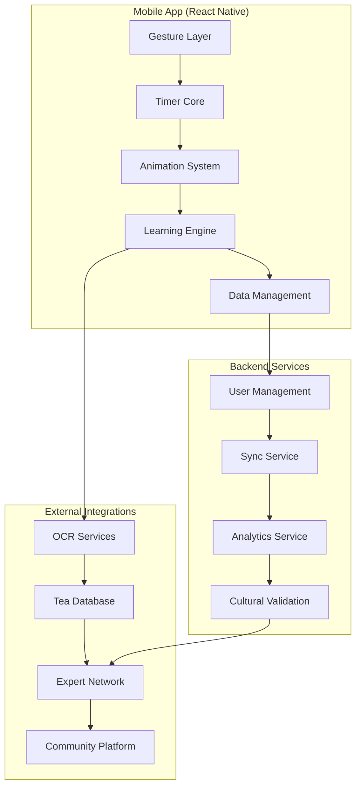

# TeaFlow Team Onboarding & Knowledge Transfer

**Document Purpose:** Comprehensive onboarding guide for developers joining the TeaFlow project  
**Created By:** Sarah (PO Agent)  
**Date:** 2025-09-11  
**Target Audience:** New team members, contractors, and knowledge transfer recipients

## Welcome to TeaFlow 🍃

TeaFlow is more than an app—it's a digital manifestation of tea culture that honors tradition while embracing modern technology. As a developer on this project, you're not just building software; you're crafting an experience that brings mindfulness and cultural appreciation to millions of tea lovers worldwide.

---

## Project Philosophy & Cultural Foundation

### **The Zen Principle**
Every line of code, every user interaction, and every design decision must honor the zen philosophy:
- **Simplicity over complexity**
- **Mindfulness over efficiency**
- **Quality over speed**
- **Cultural respect over innovation**

### **Cultural Sensitivity Requirements**
Before writing any code, understand that:
- Tea culture spans thousands of years across many civilizations
- Traditional knowledge must be respected and properly attributed
- Cultural appropriation is strictly forbidden
- Expert validation is required for all cultural content
- When in doubt, err on the side of respect and caution

### **Technical Excellence Standards**
- **95%+ test coverage** is not negotiable
- **30fps animations** minimum performance
- **<100ms gesture response** for zen experience
- **±0.2s timer accuracy** for brewing precision
- **Cultural authenticity** validated by experts

---

## Project Architecture Overview

### **High-Level System Design**



### **Technology Stack Mastery**

#### **Primary Technologies (Must Know)**
```typescript
interface RequiredSkills {
  core: {
    "React Native": "0.72+",
    "TypeScript": "5.0+", 
    "Expo": "49+",
    "Jest": "Testing framework"
  };
  state: {
    "React Context": "State management",
    "AsyncStorage": "Persistence",
    "React Query": "Server state"
  };
  ui: {
    "react-native-reanimated": "3.0+",
    "react-native-gesture-handler": "2.12+",
    "react-native-svg": "Vector graphics"
  };
  platform: {
    "iOS": "Native bridge understanding",
    "Android": "Native bridge understanding",
    "Metro": "Bundler configuration"
  };
}
```

#### **Specialized Knowledge (Learn During Project)**
- **Cultural Sensitivity**: Tea traditions and practices
- **Animation Performance**: 60fps optimization techniques
- **Gesture Recognition**: Multi-touch and conflict resolution
- **OCR Integration**: Computer vision for text recognition
- **Privacy Engineering**: GDPR-compliant analytics

### **Codebase Structure**

```
teaflow/
├── src/
│   ├── components/          # Reusable UI components
│   │   ├── ui/             # Base design system components
│   │   ├── graphics/       # Animation and visual components
│   │   └── screens/        # Screen-level components
│   ├── lib/                # Core business logic
│   │   ├── timer/          # Timer and gesture systems
│   │   ├── tea/            # Tea data and management
│   │   ├── learning/       # Preference learning engine
│   │   ├── storage/        # Data persistence
│   │   └── cultural/       # Cultural validation
│   ├── services/           # External service integrations
│   ├── utils/              # Utility functions
│   ├── types/              # TypeScript type definitions
│   └── __tests__/          # Test files
├── docs/                   # Project documentation
├── assets/                 # Images, fonts, and static files
└── scripts/               # Build and deployment scripts
```

---

## Development Environment Setup

### **Prerequisites Checklist**

#### **Required Software**
- [ ] **Node.js 18+** (Latest LTS recommended)
- [ ] **npm 9+** or **Yarn 1.22+**
- [ ] **Git 2.30+**
- [ ] **VS Code** with recommended extensions
- [ ] **Xcode 14+** (macOS only, for iOS development)
- [ ] **Android Studio** with SDK 33+
- [ ] **Expo CLI** (`npm install -g @expo/cli`)

#### **Recommended VS Code Extensions**
```json
{
  "recommendations": [
    "ms-vscode.vscode-typescript-next",
    "bradlc.vscode-tailwindcss",
    "esbenp.prettier-vscode",
    "ms-vscode.test-adapter-converter",
    "expo.vscode-expo-tools",
    "ms-vscode.vscode-react-native",
    "streetsidesoftware.code-spell-checker"
  ]
}
```

### **Initial Setup Process**

#### **Step 1: Repository Setup**
```bash
# Clone the repository
git clone https://github.com/teaflow/teaflow-app.git
cd teaflow-app

# Install dependencies
npm install

# Install iOS dependencies (macOS only)
cd ios && pod install && cd ..

# Verify setup
npm run type-check
npm test
```

#### **Step 2: Development Environment Configuration**
```bash
# Copy environment template
cp .env.example .env.local

# Configure local settings
# Edit .env.local with your local development settings

# Start Metro bundler
npm start

# In separate terminals:
npm run ios     # Start iOS simulator
npm run android # Start Android emulator
```

#### **Step 3: Verify Installation**
```typescript
// Run this test to verify your setup
describe('Development Environment', () => {
  test('should pass basic functionality test', () => {
    expect(1 + 1).toBe(2);
  });
  
  test('should have access to required dependencies', () => {
    expect(() => require('react-native')).not.toThrow();
    expect(() => require('react-native-gesture-handler')).not.toThrow();
    expect(() => require('react-native-reanimated')).not.toThrow();
  });
});
```

---

## Core Concepts Deep Dive

### **1. Gesture Recognition System**

Understanding TeaFlow's gesture system is crucial for any UI work.

#### **Gesture Types and Implementation**
```typescript
interface GestureConfig {
  centerTap: {
    zone: "middle 60% of screen";
    action: "start/pause timer";
    feedback: "medium haptic + visual pulse";
  };
  edgeTap: {
    leftZone: "leftmost 20% of screen";
    rightZone: "rightmost 20% of screen";
    action: "adjust time ±10 seconds";
    feedback: "light haptic + time overlay";
  };
  longPress: {
    duration: "1000ms default (configurable)";
    action: "reset timer to default";
    feedback: "strong haptic + fade animation";
  };
  doubleTap: {
    window: "300ms between taps";
    action: "advance to next steep";
    feedback: "medium haptic + steep indicator";
  };
}
```

#### **Gesture System Architecture**
```typescript
// Example gesture handler implementation
class TeaFlowGestureHandler {
  private config: GestureConfig;
  private haptics: HapticService;
  
  constructor(config: GestureConfig) {
    this.config = config;
    this.haptics = new HapticService();
  }
  
  processTouch(event: TouchEvent): GestureResult {
    const { locationX, locationY, timestamp } = event;
    const gestureType = this.detectGestureType(locationX, locationY);
    
    switch (gestureType) {
      case 'center_tap':
        this.haptics.medium();
        return { type: 'center_tap', action: 'toggle_timer' };
      
      case 'edge_tap_left':
        this.haptics.light();
        return { type: 'edge_tap', action: 'subtract_time', amount: 10 };
      
      // ... other gesture types
    }
  }
}
```

### **2. Animation Performance Architecture**

TeaFlow's animations are the heart of the zen experience. They must be smooth, meaningful, and culturally authentic.

#### **Animation Layer System**
```typescript
interface AnimationLayers {
  background: {
    purpose: "Subtle tea-colored gradients";
    performance: "GPU-accelerated";
    complexity: "Low (static/simple animations)";
  };
  metaphor: {
    purpose: "Tea leaves, steam, color infusion";
    performance: "Mixed CPU/GPU";
    complexity: "High (particle systems)";
  };
  feedback: {
    purpose: "Gesture confirmations, state changes";
    performance: "CPU (brief animations)";
    complexity: "Low (simple transitions)";
  };
  gesture: {
    purpose: "Transparent interaction zones";
    performance: "CPU (event handling)";
    complexity: "Low (hit detection)";
  };
}
```

#### **Performance Optimization Strategy**
```typescript
class AnimationPerformanceManager {
  private deviceCapabilities: DeviceCapabilities;
  private currentFPS: number = 60;
  
  adaptQuality() {
    if (this.currentFPS < 30) {
      // Reduce particle count
      this.reduceAnimationComplexity();
    }
    
    if (this.deviceCapabilities.isLowEnd) {
      // Use simplified animation set
      this.enableLowPowerMode();
    }
  }
  
  private reduceAnimationComplexity() {
    // Implementation for graceful degradation
    this.particleCount = Math.max(10, this.particleCount * 0.7);
    this.updateRate = Math.max(30, this.updateRate * 0.8);
  }
}
```

### **3. Tea Data Architecture & Cultural Authenticity**

Tea data is not just information—it's cultural knowledge that must be handled with respect.

#### **Tea Profile Structure**
```typescript
interface TeaProfile {
  // Basic Information
  id: string;
  name: string;
  category: TeaCategory;
  origin: TeaOrigin;
  
  // Brewing Parameters
  brewing: {
    western: BrewingMethod;
    gongfu?: BrewingMethod;
    traditional?: BrewingMethod;
  };
  
  // Cultural Context
  cultural: {
    significance?: string;
    traditionalUse?: string;
    ceremony?: string;
    attribution: CulturalAttribution;
  };
  
  // Learning Data
  learning: {
    userAdjustments: UserAdjustment[];
    popularityScore: number;
    expertRating?: number;
  };
}

interface CulturalAttribution {
  source: string;
  experts: ExpertValidation[];
  traditionalKnowledge: boolean;
  respectGuidelines: string[];
}
```

#### **Cultural Validation Process**
```typescript
class CulturalValidator {
  private expertNetwork: ExpertNetwork;
  
  async validateTeaContent(content: TeaContent): Promise<ValidationResult> {
    // Step 1: Automated screening
    const autoCheck = await this.screenForObviousIssues(content);
    if (!autoCheck.passed) {
      return { approved: false, issues: autoCheck.issues };
    }
    
    // Step 2: Expert review
    const expertReview = await this.expertNetwork.reviewContent(content);
    
    // Step 3: Cultural appropriation check
    const appropriationCheck = await this.checkCulturalAppropriation(content);
    
    return {
      approved: expertReview.approved && appropriationCheck.passed,
      feedback: [...expertReview.feedback, ...appropriationCheck.concerns],
      attribution: expertReview.attribution
    };
  }
}
```

### **4. Privacy-First Learning System**

TeaFlow learns user preferences while maintaining strict privacy protection.

#### **Learning Architecture**
```typescript
class PrivacyPreservingLearning {
  private localModel: LocalLearningModel;
  private differentialPrivacy: DifferentialPrivacyEngine;
  
  recordUserAdjustment(adjustment: UserAdjustment): void {
    // Store locally only
    this.localModel.addDataPoint(adjustment);
    
    // Optionally contribute to aggregate (anonymized)
    if (this.userConsentLevel >= ConsentLevel.AGGREGATE) {
      const anonymized = this.differentialPrivacy.anonymize(adjustment);
      this.contributeToAggregate(anonymized);
    }
  }
  
  generateRecommendations(context: BrewingContext): Recommendation[] {
    // Use only local data for personalization
    const personalRecs = this.localModel.generateRecommendations(context);
    
    // Enhance with anonymous community insights if available
    if (this.communityInsightsEnabled) {
      const communityRecs = this.getAnonymousCommunityInsights(context);
      return this.mergeRecommendations(personalRecs, communityRecs);
    }
    
    return personalRecs;
  }
}
```

---

## Development Workflow & Best Practices

### **Git Workflow**

#### **Branch Strategy**
```
main (production-ready)
├── develop (integration branch)
├── feature/epic-1-1-gesture-recognition
├── feature/epic-1-2-animations
├── hotfix/timer-accuracy-fix
└── cultural/expert-review-updates
```

#### **Commit Message Standards**
```bash
# Format: type(scope): description
# Types: feat, fix, docs, style, refactor, test, chore, cultural

feat(timer): implement gesture recognition for center tap
fix(animation): resolve memory leak in particle system
cultural(tea-data): add expert validation for Chinese tea descriptions
test(gesture): add comprehensive gesture recognition test suite
docs(api): update tea profile interface documentation
```

#### **Pull Request Process**
1. **Create feature branch** from `develop`
2. **Implement feature** following coding standards
3. **Write comprehensive tests** (95% coverage minimum)
4. **Cultural validation** (if applicable)
5. **Submit PR** with detailed description
6. **Code review** by 2+ team members
7. **Expert review** (for cultural content)
8. **Merge** to develop after approval

### **Code Quality Standards**

#### **TypeScript Configuration**
```json
{
  "compilerOptions": {
    "strict": true,
    "noImplicitAny": true,
    "noImplicitReturns": true,
    "noFallthroughCasesInSwitch": true,
    "noUncheckedIndexedAccess": true
  },
  "include": ["src/**/*"],
  "exclude": ["node_modules", "dist"]
}
```

#### **ESLint Rules (Key Highlights)**
```javascript
module.exports = {
  extends: [
    '@expo/eslint-config',
    'eslint:recommended',
    '@typescript-eslint/recommended'
  ],
  rules: {
    // Cultural sensitivity
    'no-offensive-language': 'error',
    'cultural-attribution-required': 'warn',
    
    // Performance
    'react-hooks/exhaustive-deps': 'error',
    'react-native/no-inline-styles': 'warn',
    
    // Code quality
    'prefer-const': 'error',
    'no-var': 'error',
    '@typescript-eslint/no-unused-vars': 'error'
  }
};
```

#### **Testing Standards**
```typescript
// Test file structure
describe('ComponentName', () => {
  describe('when user interacts with gestures', () => {
    it('should respond to center tap with timer toggle', () => {
      // Arrange
      const component = render(<TimerComponent />);
      
      // Act
      fireEvent.press(component.getByTestId('gesture-area'));
      
      // Assert
      expect(component.getByTestId('timer-status')).toHaveTextContent('running');
    });
  });
  
  describe('when cultural content is displayed', () => {
    it('should show proper attribution', () => {
      // Cultural content tests must include attribution verification
    });
  });
});
```

### **Performance Guidelines**

#### **Animation Performance Rules**
```typescript
// DO: Use reanimated for performance-critical animations
const animatedValue = useSharedValue(0);
const animatedStyle = useAnimatedStyle(() => ({
  transform: [{ translateY: animatedValue.value }]
}));

// DON'T: Use setState for 60fps animations
const [position, setPosition] = useState(0); // Will cause frame drops
```

#### **Memory Management**
```typescript
// DO: Clean up listeners and timers
useEffect(() => {
  const timer = setInterval(updateAnimation, 16); // 60fps
  
  return () => {
    clearInterval(timer);
  };
}, []);

// DO: Use memo for expensive calculations
const expensiveTeaCalculation = useMemo(() => {
  return calculateOptimalBrewingParameters(tea);
}, [tea.id, tea.parameters]);
```

---

## Cultural Guidelines for Developers

### **Cultural Sensitivity Checklist**

Before implementing any tea-related feature:

- [ ] **Research the cultural context** of the tea or practice
- [ ] **Consult cultural experts** if unsure about appropriateness
- [ ] **Provide proper attribution** for traditional knowledge
- [ ] **Avoid stereotypes** or oversimplifications
- [ ] **Use respectful language** in all content
- [ ] **Validate with native speakers** for non-English content

### **Cultural Content Review Process**

#### **Step 1: Self-Assessment**
```typescript
interface CulturalSelfAssessment {
  questions: [
    "Does this content respect the originating culture?",
    "Have I properly attributed traditional knowledge?",
    "Am I representing practices accurately?",
    "Could this be seen as appropriation?",
    "Have I consulted relevant experts?"
  ];
  requiredYes: 5; // All must be yes to proceed
}
```

#### **Step 2: Peer Review**
- Another developer reviews for obvious issues
- Focus on language, representation, and attribution

#### **Step 3: Expert Validation**
- Submit to cultural expert network
- Wait for approval before merging

#### **Step 4: Community Feedback**
- Monitor for community concerns post-launch
- Respond quickly to valid cultural concerns

### **Common Cultural Pitfalls to Avoid**

#### **❌ Don't Do**
```typescript
// DON'T: Oversimplify or stereotype
const teaWisdom = "Ancient Eastern wisdom for modern stress";

// DON'T: Claim spiritual properties without basis
const teaBenefits = "Connects you to ancient spirits";

// DON'T: Mix unrelated cultural practices
const ceremony = "Japanese-Native American tea ritual";
```

#### **✅ Do This Instead**
```typescript
// DO: Be specific and respectful
const teaWisdom = "Traditional Chinese tea preparation emphasizes mindfulness and presence";

// DO: Focus on documented benefits
const teaBenefits = "Traditional use for relaxation, supported by L-theanine content";

// DO: Respect cultural boundaries
const ceremony = "Inspired by Japanese tea ceremony principles of harmony and respect";
```

---

## Common Development Patterns

### **Timer Integration Pattern**
```typescript
// Standard pattern for timer-dependent components
const TimerDependentComponent: React.FC = () => {
  const { timer, isRunning, timeRemaining } = useTimer();
  const { startAnimation, pauseAnimation } = useAnimation();
  
  useEffect(() => {
    if (isRunning) {
      startAnimation();
    } else {
      pauseAnimation();
    }
  }, [isRunning]);
  
  return (
    <Animated.View style={animatedStyle}>
      <TimerDisplay time={timeRemaining} />
    </Animated.View>
  );
};
```

### **Gesture Handling Pattern**
```typescript
// Standard pattern for gesture-enabled components
const GestureEnabledComponent: React.FC = () => {
  const gestureHandler = useGestureHandler();
  const haptics = useHaptics();
  
  const handleGesture = useCallback((gesture: GestureEvent) => {
    switch (gesture.type) {
      case 'center_tap':
        haptics.medium();
        onTimerToggle();
        break;
      case 'edge_tap_left':
        haptics.light();
        onTimeAdjust(-10);
        break;
      // ... other cases
    }
  }, []);
  
  return (
    <GestureDetector gesture={gestureHandler} onGesture={handleGesture}>
      <View>{/* content */}</View>
    </GestureDetector>
  );
};
```

### **Cultural Content Pattern**
```typescript
// Standard pattern for culturally sensitive content
const CulturalContent: React.FC<{ content: CulturalTeaContent }> = ({ content }) => {
  const { isValidated, attribution } = useCulturalValidation(content);
  
  if (!isValidated) {
    return <PendingValidationMessage />;
  }
  
  return (
    <View>
      <TeaContent {...content} />
      <AttributionFooter attribution={attribution} />
    </View>
  );
};
```

---

## Debugging and Troubleshooting

### **Common Issues and Solutions**

#### **Gesture Recognition Issues**
```typescript
// Debug gesture recognition
const debugGestures = (gesture: GestureEvent) => {
  console.log('Gesture Debug:', {
    type: gesture.type,
    coordinates: { x: gesture.x, y: gesture.y },
    timestamp: gesture.timestamp,
    screenDimensions: Dimensions.get('window')
  });
};

// Check for common issues:
// 1. Screen protector interference
// 2. Gesture handler conflicts
// 3. Timing window issues
// 4. Zone boundary calculations
```

#### **Animation Performance Issues**
```typescript
// Debug animation performance
const AnimationDebugger = () => {
  const fps = useFrameRate();
  const memoryUsage = useMemoryUsage();
  
  if (__DEV__) {
    return (
      <View style={styles.debugOverlay}>
        <Text>FPS: {fps}</Text>
        <Text>Memory: {memoryUsage}MB</Text>
        <Text>Particles: {particleCount}</Text>
      </View>
    );
  }
  
  return null;
};
```

#### **Cultural Content Issues**
```typescript
// Debug cultural validation
const debugCulturalContent = (content: CulturalContent) => {
  console.log('Cultural Validation Status:', {
    content: content.id,
    validated: content.isValidated,
    experts: content.expertReviewers,
    attribution: content.attribution,
    concerns: content.validationConcerns
  });
};
```

### **Development Tools**

#### **React Native Debugger Setup**
```bash
# Install React Native Debugger
brew install --cask react-native-debugger

# Start with specific port
open "rndebugger://set-debugger-loc?host=localhost&port=8081"
```

#### **Flipper Integration**
```typescript
// Flipper plugins for TeaFlow
const flipperPlugins = [
  'react-native-flipper-performance-plugin',
  'react-native-flipper-async-storage-advanced',
  'react-native-flipper-gesture-handler',
  // Custom TeaFlow plugins
  'teaflow-cultural-content-validator',
  'teaflow-animation-performance-monitor'
];
```

---

## Knowledge Validation Checklist

### **Before You Start Coding**

- [ ] I understand TeaFlow's zen philosophy and cultural sensitivity requirements
- [ ] I have set up my development environment correctly
- [ ] I can run the app on both iOS and Android
- [ ] I understand the gesture recognition system
- [ ] I know how to implement animations with proper performance
- [ ] I understand the cultural validation process
- [ ] I can write tests that meet our coverage requirements

### **Before Submitting a PR**

- [ ] My code follows TeaFlow coding standards
- [ ] I have written comprehensive tests (95%+ coverage)
- [ ] Cultural content has been validated by experts
- [ ] Performance benchmarks are met
- [ ] Accessibility requirements are satisfied
- [ ] Documentation is updated if needed
- [ ] I have tested on both iOS and Android

### **Cultural Sensitivity Self-Check**

- [ ] I have researched the cultural context of my changes
- [ ] Traditional knowledge is properly attributed
- [ ] I am not making unsupported cultural claims
- [ ] Expert validation has been obtained where required
- [ ] Language used is respectful and accurate

---

## Getting Help

### **Internal Resources**

- **#teaflow-dev** - General development questions
- **#teaflow-cultural** - Cultural sensitivity and validation
- **#teaflow-performance** - Animation and performance optimization
- **#teaflow-testing** - Testing strategies and issues

### **Expert Network**

- **Cultural Advisors** - Available for cultural validation questions
- **Tea Masters** - Traditional knowledge and authenticity
- **UX Specialists** - Zen experience and accessibility
- **Performance Engineers** - Animation and optimization

### **Documentation**

- **Architecture Docs** - `docs/architecture/`
- **API Reference** - `docs/api/`
- **Cultural Guidelines** - `docs/cultural/`
- **Testing Guide** - `docs/testing/`

### **Emergency Contacts**

- **Cultural Issues** - Immediate expert consultation available
- **Performance Problems** - Escalation to senior team
- **Accessibility Concerns** - Dedicated accessibility team
- **Security Issues** - Security team rapid response

---

## Welcome to the Team! 🫖

Remember: You're not just building an app—you're crafting a bridge between ancient tea wisdom and modern technology. Every gesture, every animation, and every line of code contributes to creating moments of mindfulness in users' daily lives.

Take time to appreciate the cultural depth of what we're building. Brew a cup of tea, study the traditional methods, and let that understanding inform your development approach.

**Happy coding, and welcome to the TeaFlow family!**

---

*May your code be as smooth as perfectly brewed tea and as mindful as a traditional ceremony.* 🍃