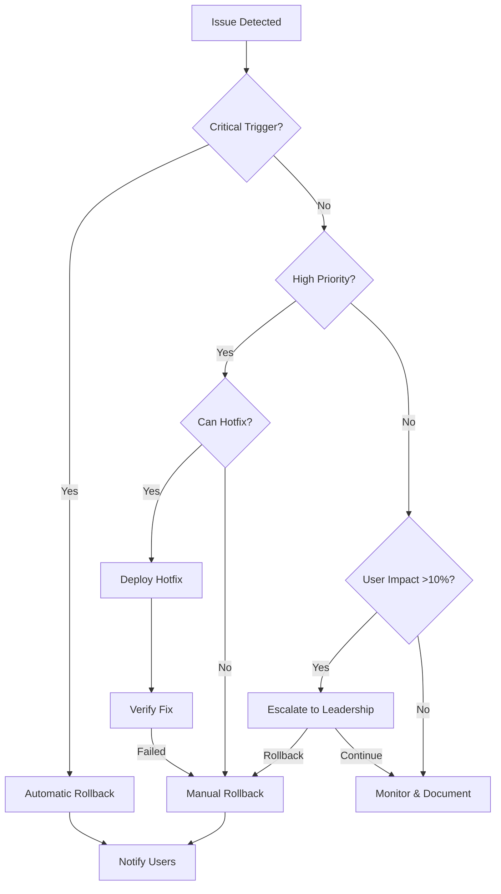

# Rollback Procedures & Triggers

## Executive Summary
This document defines comprehensive rollback triggers, procedures, and decision frameworks for TeaFlow's feature deployments, with specific focus on gesture controls, AsyncStorage migration, and progressive feature rollouts.

## Rollback Triggers Framework

### Automatic Rollback Triggers (Immediate Action)

#### Critical Triggers (Rollback within 5 minutes)
| Trigger | Threshold | Detection Method | Auto-Rollback |
|---------|-----------|------------------|---------------|
| Crash Rate | >2% increase | Crashlytics/Sentry | Yes |
| Data Loss | Any confirmed case | User reports + monitoring | Yes |
| Timer Accuracy | >5 second drift | Automated testing | Yes |
| ANR Rate (Android) | >1% increase | Play Console | Yes |
| Memory Leak | >50MB/hour | Performance monitoring | Yes |
| Security Breach | Any detected | Security scanning | Yes |

#### High Priority Triggers (Rollback within 30 minutes)
| Trigger | Threshold | Detection Method | Auto-Rollback |
|---------|-----------|------------------|---------------|
| Gesture Recognition | <85% success rate | Analytics events | No - Manual review |
| App Launch Time | >5 seconds | Performance metrics | No - Manual review |
| API Error Rate | >5% of requests | CloudWatch | No - Manual review |
| Battery Drain | >3% per session | Device telemetry | No - Manual review |
| User Engagement | >20% drop | Analytics | No - Manual review |

#### Medium Priority Triggers (Rollback within 2 hours)
| Trigger | Threshold | Detection Method | Decision Required |
|---------|-----------|------------------|-------------------|
| Feature Adoption | <30% after 48hrs | Feature flags | Product Manager |
| Support Tickets | >50/hour related | Zendesk integration | Support Lead |
| App Store Rating | <4.0 trending | Review monitoring | Product Head |
| Negative Feedback | >100 in 6 hours | Sentiment analysis | Product Manager |
| Performance Degradation | >200ms slowdown | APM tools | Engineering Lead |

## Rollback Decision Tree



## Feature-Specific Rollback Procedures

### 1. Gesture Controls Rollback

#### Pre-Rollback Checklist
- [ ] Capture current gesture analytics data
- [ ] Screenshot user feedback/reports
- [ ] Document specific failure patterns
- [ ] Verify classic controls still functional

#### Rollback Steps
```bash
# 1. Immediate flag disable (< 2 minutes)
featureFlags.set('gesture_timer_enabled', false)
featureFlags.set('haptic_feedback_enabled', false)

# 2. Force refresh all clients (< 5 minutes)
pushNotification.broadcast({
  type: 'FORCE_REFRESH',
  message: 'App update required',
  action: 'refresh_flags'
})

# 3. Enable fallback UI (< 10 minutes)
featureFlags.set('classic_timer_forced', true)
featureFlags.set('show_rollback_message', true)

# 4. Clear gesture cache
AsyncStorage.multiRemove([
  'gesture_preferences',
  'gesture_calibration',
  'gesture_tutorial_completed'
])
```

#### Post-Rollback Actions
1. **User Communication**
   ```json
   {
     "title": "Temporary Change",
     "message": "We've switched to classic controls while improving gestures",
     "action": "Use Classic Timer",
     "showDuration": 7
   }
   ```

2. **Data Preservation**
   - Export gesture interaction logs
   - Save user preference states
   - Archive performance metrics
   - Document failure patterns

3. **Recovery Planning**
   - Root cause analysis (24 hours)
   - Fix implementation (48 hours)
   - Regression testing (24 hours)
   - Staged re-rollout plan

### 2. AsyncStorage Migration Rollback

#### Risk Assessment
**Point of No Return:** After 50% of users have migrated successfully

#### Pre-Migration Backup
```typescript
const backupUserData = async () => {
  const backup = {
    timestamp: Date.now(),
    version: APP_VERSION,
    data: await AsyncStorage.getAllKeys(),
    checksums: await calculateChecksums()
  };
  
  await uploadToS3(backup);
  return backup.id;
};
```

#### Migration Rollback Procedure

**Phase 1: Stop Migration (Immediate)**
```bash
# Disable migration flag
featureFlags.set('async_storage_migration', false)

# Prevent new migrations
serverConfig.set('migration_enabled', false)

# Mark affected users
analytics.track('migration_rollback_required', {
  affected_users: getMigratedUserIds()
})
```

**Phase 2: Restore Data (Within 15 minutes)**
```typescript
const rollbackMigration = async (userId: string) => {
  try {
    // 1. Retrieve backup
    const backup = await getBackupFromS3(userId);
    
    // 2. Clear corrupted data
    await AsyncStorage.clear();
    
    // 3. Restore from backup
    await AsyncStorage.multiSet(backup.data);
    
    // 4. Verify integrity
    const valid = await verifyDataIntegrity(backup.checksums);
    
    if (!valid) {
      throw new Error('Data integrity check failed');
    }
    
    // 5. Mark as restored
    await AsyncStorage.setItem('rollback_completed', Date.now());
    
    return true;
  } catch (error) {
    // Escalate to manual recovery
    await notifyOncall(userId, error);
    return false;
  }
};
```

**Phase 3: Stabilization (Within 1 hour)**
- Disable auto-updates temporarily
- Implement data consistency checks
- Monitor for data corruption
- Provide manual recovery option

#### Data Recovery Procedures

**Automated Recovery**
```typescript
const dataRecoveryPipeline = {
  // Step 1: Identify affected users
  identifyAffected: async () => {
    return db.query(`
      SELECT user_id FROM migrations 
      WHERE status = 'failed' 
      OR completed_at > $rollback_initiated_at
    `);
  },
  
  // Step 2: Prioritize by impact
  prioritizeRecovery: (users) => {
    return users.sort((a, b) => {
      // Premium users first
      if (a.isPremium !== b.isPremium) return b.isPremium - a.isPremium;
      // Then by data size
      return b.dataSize - a.dataSize;
    });
  },
  
  // Step 3: Execute recovery
  executeRecovery: async (userId) => {
    const strategies = [
      restoreFromBackup,
      restoreFromCache,
      restoreFromExport,
      manualReconstruction
    ];
    
    for (const strategy of strategies) {
      const success = await strategy(userId);
      if (success) return true;
    }
    return false;
  }
};
```

**Manual Recovery Options**
1. User-initiated restore from export
2. Support-assisted data reconstruction
3. Account reset with compensation
4. Data merge from multiple sources

### 3. Performance Degradation Rollback

#### Performance Monitoring Baseline
```typescript
const performanceBaseline = {
  appLaunch: 2000, // ms
  screenTransition: 300, // ms
  gestureResponse: 100, // ms
  timerAccuracy: 200, // ms drift per minute
  memoryUsage: 150, // MB
  batteryDrain: 2, // % per 10min session
};
```

#### Rollback Triggers
```typescript
const performanceRollbackTriggers = {
  checkPerformance: async () => {
    const metrics = await getPerformanceMetrics();
    
    const triggers = [];
    
    // Check each metric against baseline
    if (metrics.appLaunch > performanceBaseline.appLaunch * 1.5) {
      triggers.push('APP_LAUNCH_SLOW');
    }
    
    if (metrics.memoryUsage > performanceBaseline.memoryUsage * 2) {
      triggers.push('MEMORY_LEAK');
    }
    
    if (metrics.batteryDrain > performanceBaseline.batteryDrain * 1.5) {
      triggers.push('BATTERY_DRAIN');
    }
    
    return triggers;
  },
  
  executeRollback: async (triggers) => {
    // Disable performance-heavy features
    if (triggers.includes('MEMORY_LEAK')) {
      await featureFlags.set('animations_enabled', false);
      await featureFlags.set('background_sync', false);
    }
    
    if (triggers.includes('BATTERY_DRAIN')) {
      await featureFlags.set('ml_predictions_enabled', false);
      await featureFlags.set('high_frequency_updates', false);
    }
    
    // Force garbage collection
    if (global.gc) global.gc();
    
    // Clear caches
    await clearAllCaches();
  }
};
```

## Rollback Communication Templates

### Critical Rollback - User Notification
```
Push Notification:
"TeaFlow: We've temporarily reverted a recent update to ensure the best experience. Your data is safe."

In-App Message:
Title: "Temporary Update Reversion"
Message: "We've detected an issue with our latest update and have reverted to the previous stable version. Your brewing data and preferences are completely safe. We'll have an improved update ready soon."
Actions: [Got it] [Learn More]
```

### Feature Rollback - Affected Users
```
Email Template:
Subject: "TeaFlow Feature Update"

Hi [Name],

We recently introduced [feature name] to enhance your brewing experience. Based on early feedback and monitoring, we've temporarily disabled this feature to make some improvements.

What this means for you:
• [Specific impact]
• [Alternative available]
• [Timeline for return]

Your feedback is invaluable: [Feedback Link]

Thank you for your patience,
The TeaFlow Team
```

### Migration Rollback - Data Recovery
```
Critical Alert:
Title: "Action Required: Data Recovery"
Message: "We've detected an issue with your recent app update. Please tap below to restore your tea collection and preferences."
Action: [Restore My Data]

Recovery Status:
"Restoring your data..."
✓ Preferences restored
✓ Tea collection recovered
✓ Timer history retrieved
→ Optimizing app...
"Recovery complete! Your data has been fully restored."
```

## Rollback Automation Scripts

### Feature Flag Rollback Script
```bash
#!/bin/bash
# rollback-feature.sh

FEATURE=$1
ENVIRONMENT=$2
ROLLBACK_REASON=$3

echo "🔄 Initiating rollback for $FEATURE in $ENVIRONMENT"

# 1. Disable feature flag
curl -X PATCH "https://api.launchdarkly.com/flags/$FEATURE" \
  -H "Authorization: $LD_API_KEY" \
  -d '{"enabled": false}'

# 2. Clear CDN cache
aws cloudfront create-invalidation \
  --distribution-id $CF_DISTRIBUTION_ID \
  --paths "/*"

# 3. Trigger client refresh
curl -X POST "https://api.teaflow.app/admin/force-refresh" \
  -H "Authorization: Bearer $ADMIN_TOKEN" \
  -d '{"reason": "'$ROLLBACK_REASON'"}'

# 4. Log rollback
echo "{
  \"timestamp\": \"$(date -u +%Y-%m-%dT%H:%M:%SZ)\",
  \"feature\": \"$FEATURE\",
  \"environment\": \"$ENVIRONMENT\",
  \"reason\": \"$ROLLBACK_REASON\",
  \"initiated_by\": \"$USER\"
}" >> rollback.log

# 5. Notify team
curl -X POST $SLACK_WEBHOOK \
  -d '{"text": "🚨 Rollback executed for '$FEATURE' in '$ENVIRONMENT'. Reason: '$ROLLBACK_REASON'"}'

echo "✅ Rollback complete"
```

### Database Rollback Script
```sql
-- rollback-migration.sql

BEGIN TRANSACTION;

-- Create rollback point
SAVEPOINT before_rollback;

-- Restore user preferences
INSERT INTO user_preferences_backup
SELECT * FROM user_preferences
WHERE updated_at > :migration_start_time;

-- Revert schema changes
ALTER TABLE user_preferences 
DROP COLUMN IF EXISTS gesture_config;

ALTER TABLE user_preferences 
ADD COLUMN legacy_config JSONB;

-- Restore data from backup
UPDATE user_preferences p
SET legacy_config = b.legacy_config
FROM user_preferences_backup b
WHERE p.user_id = b.user_id;

-- Verify data integrity
DO $$
DECLARE
  corrupted_count INTEGER;
BEGIN
  SELECT COUNT(*) INTO corrupted_count
  FROM user_preferences
  WHERE legacy_config IS NULL 
  AND user_id IN (
    SELECT user_id FROM migrations 
    WHERE status = 'completed'
  );
  
  IF corrupted_count > 0 THEN
    RAISE EXCEPTION 'Data corruption detected: % records', corrupted_count;
  END IF;
END $$;

-- Commit if successful
COMMIT;

-- Log rollback completion
INSERT INTO rollback_log (
  executed_at,
  affected_users,
  rollback_type,
  success
) VALUES (
  NOW(),
  (SELECT COUNT(*) FROM user_preferences_backup),
  'migration_rollback',
  true
);
```

## Rollback Testing & Validation

### Pre-Production Rollback Tests

#### Test Scenarios
1. **Feature Flag Rollback**
   - Enable feature for test users
   - Trigger rollback condition
   - Verify automatic disabling
   - Confirm user experience continuity

2. **Data Migration Rollback**
   - Migrate test dataset
   - Corrupt data intentionally
   - Execute rollback
   - Verify data integrity

3. **Performance Rollback**
   - Introduce performance degradation
   - Monitor trigger activation
   - Validate automatic optimization
   - Measure recovery time

#### Rollback Simulation Checklist
- [ ] All rollback scripts tested in staging
- [ ] Backup restoration verified
- [ ] Communication templates approved
- [ ] Team notification chains tested
- [ ] Recovery time within SLA
- [ ] No data loss confirmed
- [ ] User experience acceptable

### Post-Rollback Validation

```typescript
const validateRollback = async () => {
  const checks = {
    dataIntegrity: async () => {
      const corrupted = await db.query(`
        SELECT COUNT(*) FROM user_data 
        WHERE last_modified > $rollback_time 
        AND checksum_valid = false
      `);
      return corrupted === 0;
    },
    
    featureDisabled: async () => {
      const flag = await featureFlags.get('rolled_back_feature');
      return flag.enabled === false;
    },
    
    performanceRestored: async () => {
      const metrics = await getPerformanceMetrics();
      return metrics.all(m => m < baseline * 1.1);
    },
    
    userExperience: async () => {
      const errors = await getErrorRate('5m');
      return errors < 0.01; // Less than 1%
    }
  };
  
  const results = await Promise.all(
    Object.entries(checks).map(async ([name, check]) => ({
      name,
      passed: await check()
    }))
  );
  
  return results.every(r => r.passed);
};
```

## Rollback Metrics & Reporting

### Key Metrics to Track

| Metric | Target | Measurement |
|--------|--------|-------------|
| Time to Detection | <5 minutes | Issue created → Detection |
| Time to Decision | <10 minutes | Detection → Rollback initiated |
| Time to Rollback | <15 minutes | Initiated → Complete |
| User Impact Duration | <30 minutes | Issue start → Resolution |
| Data Recovery Rate | 100% | Successful recoveries / Total |
| Communication Lag | <5 minutes | Rollback → User notified |

### Rollback Report Template

```markdown
## Rollback Report

**Date:** [DATE]
**Feature:** [FEATURE_NAME]
**Duration:** [START] - [END]
**Affected Users:** [COUNT] ([PERCENTAGE]%)

### Timeline
- Detection: [TIME] via [METHOD]
- Decision: [TIME] by [PERSON]
- Rollback Started: [TIME]
- Rollback Completed: [TIME]
- Users Notified: [TIME]

### Root Cause
[Description of what caused the issue]

### Impact
- Users Affected: [COUNT]
- Data Loss: [NONE/DESCRIPTION]
- Revenue Impact: [AMOUNT]
- Support Tickets: [COUNT]

### Actions Taken
1. [Action 1]
2. [Action 2]
3. [Action 3]

### Lessons Learned
- [Learning 1]
- [Learning 2]

### Prevention Measures
- [Measure 1]
- [Measure 2]

### Sign-offs
- Engineering: [NAME]
- Product: [NAME]
- Leadership: [NAME]
```

## Rollback Prevention Strategies

### Pre-Release Validation
1. **Canary Deployments**
   - 1% for 24 hours
   - 5% for 48 hours
   - 25% for 72 hours
   - 50% for 1 week
   - 100% after validation

2. **Automated Testing**
   - Unit tests: >90% coverage
   - Integration tests: Critical paths
   - Performance tests: Baseline comparison
   - Chaos testing: Failure injection

3. **Feature Flag Hygiene**
   - Gradual rollout always
   - Kill switch mandatory
   - Monitoring before enabling
   - Documentation required

### Continuous Monitoring

```typescript
const monitoringConfig = {
  alerts: [
    {
      metric: 'crash_rate',
      threshold: 0.02,
      window: '5m',
      severity: 'critical'
    },
    {
      metric: 'api_errors',
      threshold: 0.05,
      window: '10m',
      severity: 'high'
    },
    {
      metric: 'user_engagement',
      threshold: -0.20,
      window: '1h',
      severity: 'medium'
    }
  ],
  
  dashboards: [
    'real-time-health',
    'user-experience',
    'performance-metrics',
    'feature-adoption'
  ],
  
  reports: {
    frequency: 'hourly',
    recipients: ['oncall@teaflow.app'],
    includeMetrics: true,
    includeAlerts: true
  }
};
```

## Appendix

### Emergency Contacts

| Role | Name | Phone | Email | Escalation |
|------|------|-------|-------|------------|
| On-Call Engineer | Rotating | Via PagerDuty | oncall@ | Primary |
| Engineering Lead | [Name] | [Phone] | [Email] | Secondary |
| Product Head | [Name] | [Phone] | [Email] | Decisions |
| CTO | [Name] | [Phone] | [Email] | Critical only |
| CEO | [Name] | [Phone] | [Email] | Data loss/breach |

### Quick Reference Commands

```bash
# Check rollback status
./scripts/rollback-status.sh

# Execute feature rollback
./scripts/rollback-feature.sh [FEATURE_NAME] [ENVIRONMENT]

# Restore user data
./scripts/restore-user-data.sh [USER_ID]

# Generate rollback report
./scripts/generate-rollback-report.sh [INCIDENT_ID]

# Test rollback procedures
./scripts/test-rollback.sh --dry-run
```

### Related Documents
- Incident Response Plan
- Feature Flag Guidelines
- Monitoring & Alerting Setup
- Data Recovery Procedures
- Communication Templates