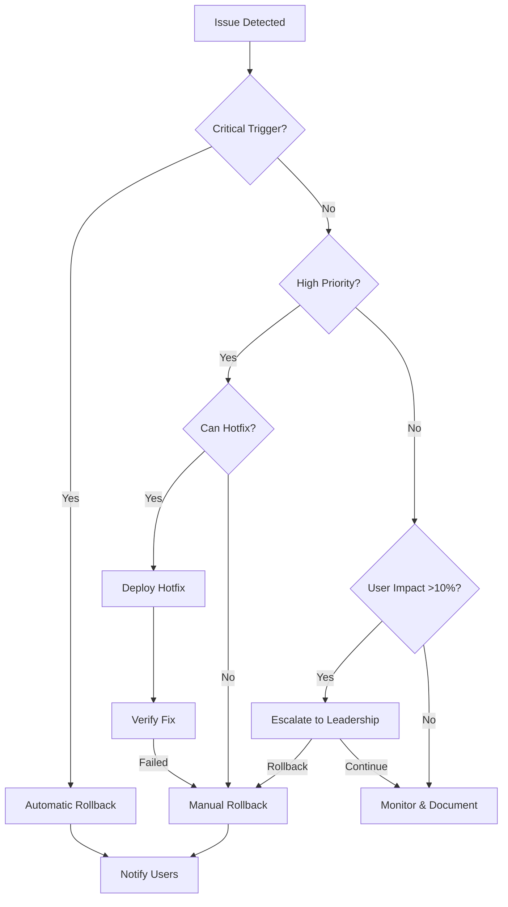

# Rollback Decision Tree

```mermaid
graph TD
    A[Issue Detected] --> B{Critical Trigger?}
    B -->|Yes| C[Automatic Rollback]
    B -->|No| D{High Priority?}
    D -->|Yes| E{Can Hotfix?}
    D -->|No| F{User Impact >10%?}
    E -->|Yes| G[Deploy Hotfix]
    E -->|No| H[Manual Rollback]
    F -->|Yes| I[Escalate to Leadership]
    F -->|No| J[Monitor & Document]
    C --> K[Notify Users]
    H --> K
    G --> L[Verify Fix]
    L -->|Failed| H
    I -->|Rollback| H
    I -->|Continue| J
```
